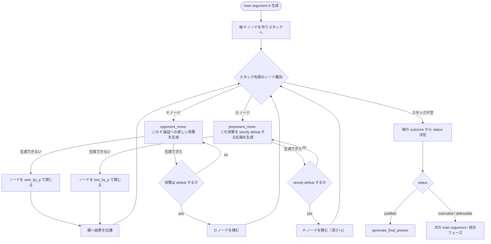

# Argumentation Model 再構築 実装計画書

作成日: 2026-09-14
対象ブランチ: `feature/argumentation-model-rebuild`（`main` から分岐）

---

## 0. この文書の読み方

- 「要確認」と付いた箇所は**実装者（ユーザー）の判断が必要な設計判断**である。
  一覧は [9. 要確認事項](#9-要確認事項) に集約した。実装は要確認事項の**推奨案（Default）で一旦最後まで作り切り**、
  後から差し替えられるよう設定値・分岐として外出ししておく。
- 既存の `docs/one_chain_protocol_revision_plan.md` は、本計画で**意図的に巻き戻す**対象である
  （後述 [2.3](#23-巻き戻す過去の設計判断)）。破棄ではなく、そこで確立した良い設計（攻撃関係を
  argument payload ではなく `DefeatRelation` に分離する方針）は引き継ぐ。

---

## 1. 目的

Prakken & Sartor (1997) の Argumentation Model、特に **argument status（justified / overruled / defensible）の
判定部分**を、原論文の定義に忠実な形へ再構築する。

具体的には、現在「A ← B ← C の一往復で打ち切る固定シナリオ」になっている対話を、
**dialogue tree（Definition 4.5〜4.8）に基づく再帰的な探索**へ置き換える。

---

## 2. 背景

### 2.1 何を誤解していたか

`Argumentation Model` を「ある一つの主張を決定するための議論プロトコル（決まった手順）」と捉えていた。

実際には手順ではなく、以下の5要素からなる**評価の枠組み**である（Prakken & Sartor, Section 1）。

| 要素 | 内容 | 現実装の対応箇所 |
|---|---|---|
| language | 論証を組む論理体系 | `src/agent/schema/llm_outputs.py`（Rule / Antecedent / Consequent） |
| argument | ルールの連鎖 | `ArgumentRecord`（`src/agent/schema/state.py:40`） |
| conflict | rebut / undercut | `argumentation_model.py:41` `attack_from_metadata` |
| defeat | どちらが勝つか | `argumentation_model.py:68` `evaluate_attack` |
| **status** | **justified / overruled / defensible** | **`nodes.py` の `complete_thread` 群（← ここが問題）** |

language〜defeat の4要素はおおむね実装されている。**status の算出だけが簡略化されすぎている。**

### 2.2 その誤解が生んだ実装上の症状

1. **status 判定が再帰していない。**
   `justified` に到達する経路がコード上 1 箇所しかない（`src/agent/nodes.py:280`）。
   これは「Opponent が A に対する攻撃 B を 1 つも生成できなかった」場合のみである。
   C が B を strictly defeat しても `justified` にはならず、`o_defeat_a` に戻って別の B' を探すだけで、
   予算切れ時は一律 `defensible`（`src/agent/nodes.py:269-270`）になる。
   → 原論文の reinstatement（Definition 3.1 / Example 2.18）が status に反映されない。

2. **C 以降が攻撃対象にならない。**
   `p_counter_b`（`nodes.py:337`）で生成した C に対する Opponent の再攻撃 D が存在しない。
   木の深さが常に 2（A→B→C）で固定されている。

3. **予算切れと真の未決着が `defensible` に混在している。**
   「試した B が全部退けられたが試行予算が尽きた」と「B と C が相互に defeat し合って決着しない」が
   同じステータスになっており、区別できない。

4. **（内容面）LLM への指示のゴールが「勝敗の確定」になっている。**
   `attack_instruction`（`prompts.py:472`）の `purpose="counter"` は冒頭が
   `Construct a counterargument that defeats the target attack.` であり、
   タスクの目的が「相手の攻撃を打ち負かすこと」というゲーム上の勝敗に設定されている。
   その結果、生成される論証の consequent が
   `"The privacy-based attack fails to defeat the claim..."` のような**勝敗宣言そのもの**になる。

   実測: `logs/synthesis_comparison/schema_synthesis/turns12_attempts01/Digital_Life_Science_Technology/artificial_intelligence/schema_20260801_220933_933322.json`
   の 12 ターン中 **7 ターン**が、相手の主張内容に踏み込まない勝敗宣言のみ。

   ※ defeat 判定ロジック自体（rebut/undercut の成立条件）は改修後も必要であり、
   これは**判定ロジックの問題ではなく、指示文のゴール設定の問題**である。

### 2.3 巻き戻す過去の設計判断

`docs/one_chain_protocol_revision_plan.md` は、`A ← B ← C ← D` の木展開をやめ、
`C strictly defeats B` を「C defeats B かつ not (B defeats C)」の相互判定で近似する方針を定めた。

この近似自体は Definition 2.16 として**正しい**。巻き戻すのはそこではなく、
**「D を生成しない ＝ 木を展開しない」という帰結**の方である。

原論文の dialogue tree では、C は次の手番で Opponent の攻撃対象になる（Definition 4.6:
`If Player_i = P then the children of move_i are all defeaters of Arg_i`）。
C は P の手番なので、C にも children（O の攻撃）がぶら下がる。ここを切ったことで木の深さが固定された。

**引き継ぐ設計（維持する）:**
- `C strictly defeats B` は B/C 相互の defeat 判定で決める（新しい論証 D の生成有無とは独立）
- 攻撃関係は argument payload ではなく `DefeatRelation` に分離して保持する
- どの argument も「攻撃される側」になったときは main argument と同じ `rules / Conc / Ass` として扱う

---

## 3. 目標仕様（Prakken & Sartor の定義）

### 3.1 dialogue（Definition 4.5）

1. `Player_i = P` iff i が奇数、`Player_i = O` iff i が偶数（交互）
2. **非反復規則**: 同一ブランチ内で P は同じ論証を 2 度使えない。**O は繰り返し可**（Example 4.4）
3. P の手（i > 1）は、直前の O の手を **strictly defeat** する**極小な**論証でなければならない
4. O の手は、直前の P の手を **defeat** すればよい（strict 不要）

### 3.2 dialogue tree（Definition 4.6, 4.7）

- 各ブランチは dialogue である
- **P の手番のノードの子は、その論証に対する O の defeater 全て**
- P がツリーに勝つ ⟺ **全てのブランチで勝つ**

### 3.3 status（Definition 3.4 / 4.8）

- **justified**: 根 A を持つ dialogue tree を P が勝ち切れる
- **overruled**: justified な論証に攻撃されている
- **defensible**: どちらでもない

### 3.4 AND/OR ツリーとしての定式化（実装用）

| ノード種別 | 直前に指した側 | 勝敗条件 |
|---|---|---|
| **P ノード**（A, C, E, ...） | P | **AND**: 全ての子（O の攻撃）を P が勝てば P の勝ち。子が 0 個（O が手を出せない）なら P の勝ち |
| **O ノード**（B, D, ...） | O | **OR**: P が strictly defeat する手を 1 つでも見つければ P の勝ち。1 つも無ければ P の負け |

根ノード A が P の勝ち ⟺ **A は justified**。

---

## 4. 設計方針

### 4.1 基本方針: 明示的なスタックによる DFS

LangGraph の StateGraph は再帰呼び出しを持たないため、**探索スタックを `State` に持たせ、
2 種類のノード（`opponent_move` / `proponent_move`）をループさせる**ことで木探索を実現する。

### 4.2 新しいデータ構造

`src/agent/schema/state.py` に追加:

```python
class DialogueNode(BaseModel):
    """dialogue tree の 1 ノード（= 1 手）。"""

    id: str                              # ノード ID（ArgumentRecord.id とは別）
    parent_id: str | None                # 根は None
    player: Literal["P", "O"]
    argument_id: str                     # 対応する ArgumentRecord.id
    depth: int                           # 根 = 0
    # この P ノードで O が試した攻撃回数 / この O ノードで P が試した反論回数
    attempts: int = 0
    # "open": 未確定 / "won_by_p": P の勝ち / "lost_by_p": P の負け
    # "undetermined": 予算切れで未確定のまま打ち切り
    outcome: Literal["open", "won_by_p", "lost_by_p", "undetermined"] = "open"
    # 予算切れによる勝ちなのか、真に相手が手を出せなかったのかの区別
    closed_by_budget: bool = False
```

`State`（`src/agent/workflow.py:47`）に追加するフィールド:

```python
dialogue_nodes: list[DialogueNode] = field(default_factory=list)
node_stack: list[str] = field(default_factory=list)   # DFS スタック（DialogueNode.id）
current_node_id: str | None = None
root_node_id: str | None = None
max_tree_depth: int = _int_env("MAX_TREE_DEPTH", 6)          # 新規
max_counter_attempts: int = _int_env("MAX_COUNTER_ATTEMPTS", 3)  # 新規（P 側のリトライ上限）
```

既存の `b_argument` / `c_argument` / `b_defeats_a` / `c_defeats_b` / `b_defeats_c` /
`c_strictly_defeats_b` は、木構造に置き換わるため**削除または「現在検証中のペア」を指す
汎用フィールドへリネーム**する（`attacker_argument` / `target_argument` など）。

### 4.3 新しいグラフ構造



グラフノード（LangGraph）:

| ノード名 | 責務 | 置き換える既存ノード |
|---|---|---|
| `init_dialogue_tree` | main argument から根 P ノードを作りスタック初期化 | （新規） |
| `opponent_move` | 現在の P ノードへの新しい攻撃を 1 つ生成 | `o_defeat_a` |
| `validate_opponent_move` | 攻撃が target を defeat するか判定 | `validate_b_defeats_a` |
| `proponent_move` | 現在の O ノードへの反論を 1 つ生成 | `p_counter_b` |
| `validate_proponent_move` | 反論が **strictly** defeat するか判定（defeat 判定 + 逆向き判定） | `validate_c_defeats_b` + `validate_b_defeats_c` |
| `close_node` | ノードを閉じ、親へ AND/OR 伝播、次のノードを `current_node_id` へ | （新規） |
| `resolve_tree_status` | 根の outcome から justified / overruled / defensible を決定 | `complete_thread` の status 決定部分 |

### 4.4 予算（原論文の有限理論を近似する安全装置）

原論文では、論証は**有限のルール集合からの組み合わせ**なので探索は必ず有限で停止する
（Section 8）。LLM は論証を都度生成するため停止保証がない。よって以下の予算を設ける。

| 予算 | 意味 | 予算切れ時の扱い |
|---|---|---|
| `max_attack_attempts`（既存） | 1 つの P ノードで O が試せる攻撃の回数 | ノードを `won_by_p` かつ `closed_by_budget=True` で閉じる |
| `max_counter_attempts`（新規） | 1 つの O ノードで P が試せる反論の回数 | ノードを `lost_by_p` かつ `closed_by_budget=True` で閉じる |
| `max_tree_depth`（新規） | 木の最大深さ | そのノードを `undetermined` で閉じる |
| `max_dialogue_turns`（既存） | 対話ターン総数の絶対上限 | 探索全体を打ち切り、未閉のノードを `undetermined` に |

**重要**: `closed_by_budget` / `undetermined` のフラグを残すことで、
「予算内で正当化された（justified within budget）」と「真に反論が尽きて正当化された（provably justified）」を
評価時に区別できる。現状の「全部 defensible」という潰し方をやめる。

### 4.5 status の決定（`resolve_tree_status`）

```
根ノードの outcome:
  won_by_p  かつ 木に undetermined が無い   → justified          （証明済み）
  won_by_p  かつ 木に undetermined がある   → justified_by_budget（要確認 #2）
  lost_by_p かつ closed_by_budget=False     → overruled          （真に反論できなかった）
  lost_by_p かつ closed_by_budget=True      → defensible         （P の探索予算切れ）
  undetermined                              → defensible
```

### 4.6 非反復規則（Definition 4.5 条件 2）

- **P 側**: 同一ブランチ（根からそのノードまでの祖先パス）で、過去に自分が使った論証と
  実質的に同じものを再提示できない。既存の `has_new_point` 自己申告を、
  **ブランチ内の祖先 P 論証のみ**を提示して判定させる形に変更する。
- **O 側**: 論文上は繰り返し可。ただし**同じ P ノードに対して同じ攻撃を繰り返すのは探索の無駄**なので、
  現行どおり同一ノード内のみ重複を弾く（`has_new_point`）。

### 4.7 プロンプト改修（内容の薄さへの対処）

defeat 判定ロジックは維持したまま、**LLM への指示のゴールを「勝敗の確定」から「実質的な主張の生成」へ切り替える**。

1. `attack_instruction`（`prompts.py:472`）の `<task>` を書き換える。
   - 変更前（counter）: `Construct a counterargument that defeats the target attack.`
   - 変更後（案）: `Round N. The opponent challenged your position on <target_statement>. State what you claim to be true about <issue> that answers this specific challenge.`
   - 攻撃種別（rebut/undercut）と target は、**論証本体とは別の構造化フィールド**として宣言させる
     （現行の `Attack` フィールドを維持）。論証本体の役割は「トピックについての実質的な主張」に限定する。

2. **メタ結論の機械的な拒否**を `validate_argument_body`（`arguments.py:234`）に追加する。
   consequent が「defeat の成否そのもの」を述べている場合は違反として `_repair_instruction` で再生成させる。
   検出語（初版・要確認 #5）:
   `fails to defeat`, `does not defeat`, `fails to undercut`, `does not undercut`,
   `does not follow from its premises`, `the target attack`, `the target argument`,
   `AG1's`/`AG2's ... argument` を主語に取る結論 など。

3. `feature/justifiy-end-skip` の commit `4e334f8` に含まれる以下の改善を**取り込む（cherry-pick 相当）**。
   - `weak_negation` の定義明確化（`"X is not the case"` 形式の可反証な仮定に限定し、
     スコープ規定や定義を weak_negation に入れない）: `prompts.py`, `schema/llm_outputs.py`
   - `undercut` の成立条件の厳格化（「X が実際に成り立つことを証明せよ」）: `prompts.py`

---

## 5. 実装ステップ

各フェーズは単体で `pytest` が通る状態を保つ。

> **実装状況（2026-09-14 時点）**: Phase 0/2/3/4 はコード実装・単体テストとも完了。
> Phase 1 は「記録だけ」の中間ステップを経ず、Phase 2/3 と合わせて直接実装した
> （最終形は計画どおり）。Phase 5 は実際の LLM 呼び出しを伴う実測が必要なため、
> このセッションでは未実施（コード上は `no_schema` も同じグラフを通るため動作するはず）。
> ブランチ: `feature/argumentation-model-rebuild`。

### Phase 0: 準備（振る舞いを変えない） ✅ 完了

- [x] `feature/justifiy-end-skip` の `4e334f8` から、プロンプト改善分のみを取り込む
      （`prompts.py` の weak_negation / undercut 定義、`schema/llm_outputs.py` の description）。
      ※ 同コミットの `edges.py` / `workflow.py`（justified → 最終回答の遷移削除）は**取り込まない**。
- [x] 既存テストが緑であることを確認（`tests/unit_tests/test_defeat_subgraphs.py` 等）。

### Phase 1〜3: データ構造の導入・status 判定の木ベース化・再帰探索 ✅ 完了

Phase 1（記録だけ）を経由せず、最終形（Phase 3 相当）を直接実装した。

- [x] `DialogueNode` を `src/agent/schema/state.py` に追加。
- [x] `State` に `dialogue_nodes` / `node_stack` / `root_node_id` / `max_tree_depth` /
      `max_counter_attempts` 他、探索用の一時フィールドを追加
      （`current_node_id` は使わず `node_stack[-1]` を都度参照する設計にした）。
- [x] `opponent_move` / `validate_opponent_move` / `proponent_move` /
      `validate_proponent_move` / `pop_and_propagate` / `resolve_tree_status` を実装
      （`o_defeat_a` 等の固定 A/B/C ノードは廃止）。
- [x] `workflow.py` のグラフを新ノード構成へ再配線。
- [x] `max_tree_depth` / `max_counter_attempts` の予算チェックを実装。
- [x] `edges.py` の `justified → generate_final_answer` 遷移は維持（要確認 #1 の Default どおり）。
- [x] 深さ4（A→B→C→D→E）の再帰探索をモック LLM で確認
      （`tests/unit_tests/test_dialogue_tree.py::test_depth_four_recursion_reaches_justified`）。
- [x] reinstatement（C strictly defeats B → justified）が正しく反映されることを確認
      （同ファイル `test_reinstatement_after_strict_defeat_is_justified`。旧実装が
      `defensible` を返していたケース）。

### Phase 4: 非反復規則とプロンプト改修 △ 一部完了

- [ ] ブランチ内祖先のみを見る非反復判定への変更（[4.6](#46-非反復規則definition-45-条件-2)）は
      **未着手**。現状は旧実装のまま、O は同一フレーム内の自分の過去の試みとのみ比較する
      （`has_new_point` 自己申告、`generate_attack` の `attempt_count` 引数）。祖先パス全体を
      横断した比較はしていないため、深い木では理論上わずかに緩い可能性がある。
- [x] `attack_instruction` の `<task>` 書き換え（[4.7](#47-プロンプト改修内容の薄さへの対処)-1）。
      勝敗確定ではなく実質的な主張を書かせるよう変更し、`<content_requirement>` ブロックを追加。
- [x] `validate_argument_body` にメタ結論拒否を追加（[4.7](#47-プロンプト改修内容の薄さへの対処)-2）。
      キーワード検出方式（要確認 #5 の Default）。
- [ ] メタ結論が実際に減ったかを、少数トピックの実走ログで確認する **（要・実際の LLM 呼び出し。未実施）**。

### Phase 5: no_schema 条件への反映と評価準備 △ 一部完了

- [ ] `output_mode="no_schema"` でも同じ木探索プロトコルが動くことの実走確認（要確認 #4）
      **（コード上は同じグラフ・同じノードを通るため動作するはずだが、実際の LLM 呼び出しでの
      確認は未実施）**。
- [x] 対話ターン数・木の深さ・ノード数・メタ結論率をメトリクスとして出力に追加
      （`experiments/dialogue/common.py` の `_dialogue_tree_metrics()`、[8](#8-評価計画)）。
- [ ] 少数トピック（3〜5 件）でコストと所要時間を実測し、全件走行の見積りを取る
      **（要・実際の LLM 呼び出し。未実施 — 次のアクション）**。

---

## 6. 影響範囲

| ファイル | 変更内容 |
|---|---|
| `src/agent/schema/state.py` | `DialogueNode` 追加 |
| `src/agent/workflow.py` | `State` フィールド追加・削除、グラフ再配線 |
| `src/agent/nodes.py` | `o_defeat_a` / `p_counter_b` / `validate_*` を木ベースへ書き換え、`close_node` / `resolve_tree_status` 追加 |
| `src/agent/edges.py` | ルーティングをスタック駆動へ書き換え |
| `src/agent/prompts.py` | `attack_instruction` の task 書き換え、weak_negation / undercut 定義取り込み |
| `src/agent/arguments.py` | `validate_argument_body` にメタ結論拒否、非反復判定の対象をブランチ祖先へ |
| `src/agent/argumentation_model.py` | 変更なし（`evaluate_attack` はそのまま再利用） |
| `tests/unit_tests/test_defeat_subgraphs.py` | 木ベースの判定に合わせて全面改訂 |
| `experiments/dialogue/common.py` | `base_log()` に新規メトリクス追加（[8](#8-評価計画)） |

`mad.py` / `free_debate.py` はベースライン手法なので**変更しない**。

---

## 7. テスト計画

### 7.1 単体テスト（LLM をモックし、木の解決ロジックだけを検証）

`tests/unit_tests/test_dialogue_tree.py` に実装済み。

- [x] O が攻撃を 1 つも出せない → 根 justified（深さ 0 の木）
- [x] B が A を defeat、C が B を strictly defeat、C への攻撃なし → 根 justified（**旧実装が落ちるケース**）
- [x] B が A を defeat、C が B を defeat できない → 根 overruled
- [x] B が A を defeat、C が B を defeat するが B も C を defeat する → 根 defensible
- [x] 深さ 4（A→B→C→D→E）で E に攻撃が尽きる → 根 justified（再帰の伝播）
- [x] `max_attack_attempts` / `max_counter_attempts` 切れ → `closed_by_budget=True` を記録
      （`tests/unit_tests/test_dialogue_turn_budget.py`）
- [ ] A への攻撃が B1, B2 の 2 本で、B1 は退けたが B2 を退けられない → 根 not justified（AND 条件）
      — 個別テストとしては未追加（`_run_tree` ヘルパは単一の攻撃系列のみを想定した作りのため、
      複数並行攻撃のシナリオを流すには拡張が要る）。
- [ ] `max_tree_depth` 到達 → `undetermined` 経由で defensible — 個別テスト未追加。
- [ ] 非反復: P が同一ブランチ祖先と同じ論証を出そうとすると弾かれる／O は別ブランチで同じ
      論証を出せる — Phase 4 の非反復範囲変更が未着手のため、これに対応するテストも未実装。

### 7.2 契約テスト ✅ 完了

- [x] `validate_argument_body` がメタ結論（`"... fails to defeat ..."`）を違反として検出する
      （`tests/unit_tests/test_defeat_subgraphs.py::test_validate_argument_body_rejects_meta_conclusion_verdicts`）
- [x] `attack_instruction` の `<task>` に「勝敗を目的とする」文言が含まれない
      （同ファイル `test_attack_instruction_task_does_not_frame_goal_as_defeating_the_target`）

### 7.3 統合テスト

- [x] `tests/integration_tests/test_graph.py` を新ノード構成の存在確認へ更新
      （実際に木探索をモック LLM で完走させる統合テストではなく、グラフ構造の静的確認に留まる）
- [ ] `experiments/dialogue/test_protocol_regression.py` は手動実行スクリプト（実 LLM 呼び出し）
      のため、このセッションでは実行していない。公開 API（`run_schema_topic_once` 等）のシグネチャは
      変えていないため動くはずだが、実走確認は次のアクション。

---

## 8. 評価計画

改修後の主張は「スキーマ導入により、(a) 建設的な議論が可能になり、(b) 結果的に議論の膨張を防げる」である。
これを支えるため、既存の品質指標に加えて**効率側の指標**を出力へ追加する。

| 指標 | 目的 | 取得元 |
|---|---|---|
| 反論の建設性（既存 LLM judge） | (a) の検証 | `experiments/eval/scoring/evaluation_rubrics.py` |
| スタンス取り込み（既存） | (a) の検証 | 同上 |
| 構造指標（既存 `structural_constructiveness`） | (a) の補強 | 同上 |
| **メタ結論率（新規）** | 「勝敗宣言のみのターン」の割合。改修前 7/12 が基準線 | 対話ログの consequent を検査 |
| **総対話ターン数（新規）** | (b) の検証。同品質ならターン数が少ないほど良い | `dialogue_history` の長さ |
| **木の深さ・ノード数（新規）** | 探索構造の可視化 | `dialogue_nodes` |
| **justified 到達率 / 予算切れ率（新規）** | 「決着がついた」と言えているかの検証 | `resolve_tree_status` の結果 |

新規指標の出力先は `experiments/dialogue/common.py:304` の `base_log()` の `metrics`。
木構造そのものを残す場合は同ファイル `_speech_log()`（`:323`）と並べて
`dialogue_tree` キーを追加する（要確認 #7 のログ肥大とのトレードオフあり）。

比較条件は現行どおり `schema` / `no_schema` / `mad` / `free_debate` の 4 手法。

---

## 9. 要確認事項

> 実装は各項目の **Default** で進める。後から切り替えられるよう、設定値または分岐として実装する。

### #1 justified な主張が出たとき、統合フェーズをスキップしてよいか

原論文に忠実にすると「justified な論証 = 最終回答」であり、`main` の
`edges.py:129-130` のとおり即座に `generate_final_answer` へ遷移する。
しかしそうすると、**片方の主張がそのまま最終回答になり、もう一方の意見が反映されない**。
これは「両者の意見を統合する」という本研究の目的と衝突する（Kido & Kurihara の統合フェーズが走らなくなる）。

- **Default（実装する案）**: 原論文どおり justified → 即最終回答。統合はスキップ。
- 代替案 A: justified に到達しても統合フェーズを 1 回通してから最終回答を作る
- 代替案 B: justified な論証を「最終回答の土台」とし、相手の未取り込みスタンスを補足として加える
  （`feature/justifiy-end-skip` の `_leftover_main_rule_text` に近い発想）

**確認したいこと**: 「原論文への忠実さ」と「両者統合」のどちらを主張の軸に置くか。
研究の売りが「統合」なら代替案 A/B、「忠実な再現＋LLM 特有の問題解決」なら Default。

---

### #2 予算切れで閉じた justified を、justified と呼んでよいか

`max_attack_attempts` を使い切るまで O が有効な攻撃を出せなかった場合、
原論文の「O が手を出せない」と同じ扱いにするか。厳密には「予算内で見つからなかった」に過ぎない。

- **Default**: `justified` とするが `closed_by_budget=True` を記録し、評価時に
  「provably justified」と「justified within budget」を分けて集計できるようにする。
- 代替案: 予算切れは一律 `defensible` にする（現行挙動。ただし justified がほぼ出なくなる）

**確認したいこと**: 論文に書くときに「justified」と言い切れる水準をどこに置くか。

---

### #3 木の深さ上限（`max_tree_depth`）の既定値

深さが増えると LLM 呼び出し回数は指数的に増える。
既存実測コスト: 4 手法 × 99 トピックで約 $146（schema が $72 を占める。gpt-5-nano, reasoning_effort=high）。
木を深さ 6 まで展開すると、schema のコストは**数倍**になる可能性がある。

- **Default**: `MAX_TREE_DEPTH=6`（= A→B→C→D→E→F。P が 3 手、O が 3 手）
- 代替案: まず `4` で実装・実測し、コストを見てから上げる

**確認したいこと**: 予算上限。少数トピックでの実測後に再設定する前提でよいか。

---

### #4 `no_schema` 条件も同じ木探索にするか

比較の公平性から言えば、**プロトコルは同一で出力形式だけが違う**べきである（現行の設計思想）。
しかし木探索は「rebut/undercut の形式判定」に依存しており、no_schema では構造が無い。

- **Default**: 現行どおり、`attack`（rebut/undercut）と target の宣言は no_schema でも構造化出力で保持し、
  同一の木探索を走らせる。論証本体だけが自由記述。
- 代替案: no_schema は従来の一往復のままにし、「木探索そのものが schema の効果」と位置づける

**確認したいこと**: 「スキーマの効果」として何を主張したいか。
Default だと差は「論証本体の構造化の有無」のみ、代替案だと「探索構造ごと」が差になる。
ただし代替案は交絡が増えるため、Default を推奨する。

---

### #5 メタ結論の検出方法

`validate_argument_body` でキーワード検出するか、LLM に判定させるか。

- **Default**: キーワードによる機械的検出（決定論的・無料・テストしやすい）。
  誤検出が出たら語彙を調整する。
- 代替案: 軽量モデル（gpt-5-mini 等）による判定を 1 回挟む（精度は上がるがコストとレイテンシが増える）

**確認したいこと**: 初版はキーワードで進めてよいか。検出語の初期リストは [4.7](#47-プロンプト改修内容の薄さへの対処)-2 参照。

---

### #6 `main argument` を 1 ラウンドに何本まで出すか

現行は AG1 → AG2 の 1 本ずつで、それぞれに木を作る。木が深くなるとラウンドあたりのコストが増えるため、
`max_turns`（ラウンド上限、既定 5）との組み合わせを見直す必要がある。

- **Default**: 現行どおり 1 ラウンド 1 本ずつ、`MAX_TURNS` の既定は 5 のまま。
  実測後に `MAX_TREE_DEPTH` とのバランスで調整する。

**確認したいこと**: ラウンド数と木の深さ、どちらにコストを配分するか。

---

### #7 既存ログ・評価結果の扱い

プロトコルが変わるため、`logs/` 以下の既存走行結果は改修後の実装と直接比較できない。

- **Default**: 既存ログは「改修前のベースライン」として保持し、削除しない。
  改修後は別ディレクトリ（例 `logs/v2_*`）に出力する。
- 注記: 過去に `logs/` が外部要因で消失した事故があるため、
  比較に使う結果はコミットするか別の場所へ退避しておくことを推奨する。

---

## 10. 参照

- Prakken, H. & Sartor, G. (1997). *Argument-based extended logic programming with defeasible priorities.*
  Journal of Applied Non-Classical Logics, 7(1-2), 25-75.
  - Definition 2.8（attack）, 2.15（rebut/undercut）, 2.16（defeat / strictly defeat）
  - Definition 3.1（acceptability）, 3.4（justified / overruled / defensible）
  - Definition 4.5（dialogue）, 4.6（dialogue tree）, 4.7（勝敗）, 4.8（provably justified）
  - Section 8（有限理論での決定可能性 ＝ 探索が停止する根拠）
- Kido, H. & Kurihara, M. (2009). *Computational Dialectics Based on Specialization and Generalization.*
  JSAI 2008, LNAI 5447, 228-241.
  - Section 5（Argumentation Model = Prakken & Sartor の簡略版を借用）
  - Definition 1, 6, 7（collaboration / concession / compromise ＝ 統合フェーズの根拠）
- `docs/one_chain_protocol_revision_plan.md`（本計画で巻き戻す対象。[2.3](#23-巻き戻す過去の設計判断) 参照）
- `docs/schema_nano_underperformance_report.md`（評価で負けている件の既存分析）
