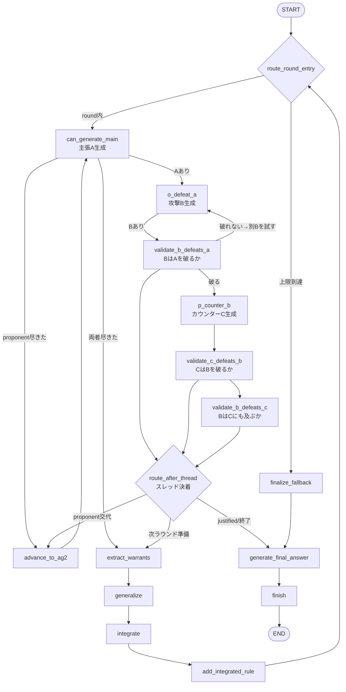

# 実装オーバービュー（`src/agent` と `experiments/eval`）

このドキュメントは、自分で実装を追えるようにするための地図です。
「議論を生成する本体（`src/agent`）」と「生成された議論を採点する評価系（`experiments/eval`）」の
2つに分けて、各ファイルの役割・データの流れ・主要な関数をまとめます。

- **本体（配布パッケージ）**: `src/agent/` … LangGraph ベースのマルチエージェント議論システム
- **実験ハーネス**: `experiments/dialogue/`（本体を回してログを作る）＋ `experiments/eval/`（ログを採点する）

---

## 0. 全体像（データの流れ）

```
datasets/<category>/<topic>.json            トピック（Issue + 両者スタンス）
        │
        ▼  experiments/dialogue/runners/*   （本体を呼んで議論を回す）
src/agent の graph を実行
        │
        ▼
logs/<sweep>/…/<method>_<timestamp>.json    実行ログ（dialogue_history / final_answer / metrics）
        │
        ▼  experiments/eval/runners/*       （ログを読んで LLM 採点）
eval_results*.json                          スコア（軸ごとの点数）
        │
        ▼  experiments/eval/plots / 手動集計
グラフ・比較表
```

議論の「手法（method）」は4種類。すべて**同じグラフではなく**、schema/no_schema は同一グラフ
（`output_mode` だけ違う）、mad/free_debate は別グラフ（別プロトコル）です。

| method | 実体 | 特徴 |
|---|---|---|
| `schema` | `src/agent` の本体グラフ（`output_mode="schema"`） | 論証を rules/Conc/Ass の**構造化出力**で強制 |
| `no_schema` | 同じ本体グラフ（`output_mode="no_schema"`） | 論証本体は**自由記述**（可否判定と攻撃種別のみ構造化） |
| `mad` | `src/agent/mad.py` | Multi-Agent Debate。往復するだけの自由討論 |
| `free_debate` | `src/agent/free_debate.py` | 自由討論プロトコル |

---

## 1. 本体：`src/agent/`

### 1-1. プロトコル（何をやっているか）

1つの Issue について、AG1 と AG2 が固定スタンスで議論する。1ラウンドは
**弁証法スレッド（dialectical thread）**として進む：

- **main**: proponent が主張 A を出す
- **defeat**: opponent が A を攻撃する論証 B（rebut または undercut）
- **counter**: proponent が B に反論する C（rebut は undercut で無効化されうる）

スレッドは main の `status` に3値のいずれかで決着する：

| status | 意味 | 帰結 |
|---|---|---|
| `justified` | 全攻撃に耐えた | この答えで議論終了（＝合意） |
| `overruled` | 防御できず敗北 | 新しい main を出す |
| `defensible` | 相打ち（決着せず） | 未解決のまま次へ |

どちらの main も justified にならなければ、両者の warrant（最終ルール）を
**汎化・統合**して「integrated rule（両者が受け入れる共有ルール）」を作り、
次ラウンドはそれを土台に新しい main を組む。`max_turns` 到達で打ち切り、
それまでの議論と integrated rule から最終回答を作る。

### 1-2. ファイル別の役割

| ファイル | 役割 |
|---|---|
| [workflow.py](../src/agent/workflow.py) | `State`（全状態を持つ dataclass）と **LangGraph グラフ**の定義。ここがエントリ。 |
| [nodes.py](../src/agent/nodes.py) | グラフの各**ノード**（`can_generate_main` / `o_defeat_a` / `p_counter_b` / `validate_*` / `generalize` / `integrate` / `generate_final_answer` 等）の実装 |
| [edges.py](../src/agent/edges.py) | 各ノード後の**条件分岐（ルーティング）**関数。State を見て次のノード名を返す |
| [argumentation_model.py](../src/agent/argumentation_model.py) | 攻撃の成否判定。`evaluate_attack` が rebut/undercut を判定し、`DefeatRelation`（defeat 関係）を計算 |
| [arguments.py](../src/agent/arguments.py) | **LLM 生成**の実体。`generate_main` / `generate_attack` / `generate_undercut` / `generate_final_answer`。schema の構造検証（`validate_argument_body`）と履歴整形もここ |
| [prompts.py](../src/agent/prompts.py) | 全**プロンプト**（SYSTEM テンプレート・共有ブロック・手番ごとの指示ビルダ）を集約 |
| [llm.py](../src/agent/llm.py) | LLM 呼び出しラッパ。`chat_structured`（構造化出力）/ `chat_text`。GPT-5系は `reasoning_effort` / `verbosity` を付与（既定 `high`、env `REASONING_EFFORT` で上書き） |
| [mad.py](../src/agent/mad.py) | ベースライン: Multi-Agent Debate（別グラフ `graph_mad`） |
| [free_debate.py](../src/agent/free_debate.py) | ベースライン: 自由討論（別グラフ `graph_free_debate`） |
| [schema/state.py](../src/agent/schema/state.py) | `ArgumentRecord`（1論証の簿記）/ `DefeatRelation` 等の Pydantic モデル |
| [schema/llm_outputs.py](../src/agent/schema/llm_outputs.py) | LLM 構造化出力のスキーマ。`ArgumentBody`（rules/Conc/Ass）、`MainArgumentAvailabilityOutput` 等 |
| [schema/types.py](../src/agent/schema/types.py) | `AgentName` / `AttackType` / `DebateStage` などの型 |

### 1-3. グラフの流れ（本体グラフ）



> 補足: `validate_*` ノード群が「もう一度別の攻撃を試す（`thread_needs_retry`）／スレッド決着」を
> 決めている。決着後 `route_after_thread` が「相手番に交代 / 次ラウンドの統合へ / 最終回答へ」を分岐する。

### 1-4. schema と no_schema の違い（1箇所だけ）

`State.output_mode` で切り替わる（[workflow.py](../src/agent/workflow.py) の State 定義参照）。

- **schema**: 論証本体を `ArgumentBody`（rules/Conc/Ass）の構造化出力で強制。生成後 `validate_argument_body` で連鎖の妥当性を検証（違反時1回だけ矯正再生成）。
- **no_schema**: 論証本体は自由記述テキスト。ただし「生成可否（can_generate 等）」と「攻撃種別＋対象（rebut/undercut + target）」は弁証法遷移の機械判定に必要なので**両モードとも構造化出力のまま**。

### 1-5. 両スタンスの要件を保持する仕組み

`stance → main argument → generalized criteria → integrated rule → final answer` の各段階で、
片側の要件や具体条件が中間表現から脱落しないよう、次のカバレッジ契約を置いている。

- `main_instruction`: 自分のスタンスにある理由・要件・条件・対象集団・数値を先に列挙し、
  全項目を主論証の推論に含める。
- `generalization_instruction` / `integration_instruction`: warrantだけでなく両者の元スタンスも入力し、
  warrantへの圧縮時に消えた要件を復元する。
- integrated rule: 各基準の「条件→帰結」の対応を保持する。異なる帰結を支える条件を曖昧な
  `OR`へまとめず、どの条件ならどの帰結になるかを一つの意思決定ルールとして表す。
  両条件が同時に成立し得る場合は同じ証拠水準で比較し、元の基準にない慎重側デフォルトや
  自動的な拒否権を追加しない。
- `generate_final_answer`: justified/fallbackのどちらでも両スタンスと既存integrated rulesを渡す。
  最終回答は各要件を満たす・限定する・理由付きで退ける、のいずれかで明示的に処理する。
- `validate_argument_body`: 空の帰結や`No additional rule needed`のようなダミー先行詞を拒否し、
  構造修復を要求する。

---

## 2. 評価系：`experiments/eval/`

役割は「実行ログ（JSON）を読み、LLM 評価器に渡す**共通フォーマットの transcript** に整形し、
軸ごとに採点する」。生成コストはかからない（ログを読むだけ）。評価器の LLM 推論分のみ課金。

```
experiments/eval/
├─ scoring/     採点ロジック（入力整形・プロンプト・パース）
├─ runners/     実行CLI（sweepを一括採点）
└─ plots/       作図
```

### 2-1. `scoring/` — 採点ロジック

| ファイル | 役割 |
|---|---|
| [evaluation.py](../experiments/eval/scoring/evaluation.py) | **共通の心臓部**。`build_eval_input`（ログ → question/stance/**debate_transcript**/final_answer/integrated_rules へ整形）。schema の JSON を発話体英文へ変換する `_schema_utterance` もここ。**4軸(coherence/originality/dialecticality/validity)** の `SCORING_INSTRUCTION` と `evaluate_with_llm`、`efficiency_metrics`（時間/コスト/トークン） |
| [evaluation_rubrics.py](../experiments/eval/scoring/evaluation_rubrics.py) | **新ルーブリック2軸**。`evaluate_constructiveness`（transcript を見る）／ `evaluate_constraint_preservation`（stance＋final_answer＋integrated_rules を見る、transcript は見ない）。`evaluate_rubrics` が両者を呼ぶ |
| [evaluation_pairwise.py](../experiments/eval/scoring/evaluation_pairwise.py) | ペア単位（対象1発言 + それへの1応答）で Constructiveness を採点。`extract_pairs` → `evaluate_pair` |
| [evaluation_ranking.py](../experiments/eval/scoring/evaluation_ranking.py) | 同一トピックの4手法の議論を1プロンプトに並べ、**相対順位**を付けさせる |

#### transcript 整形（`build_eval_input`）が重要

全手法を**同じ体裁**の transcript に揃える。ここが評価の公平性の要。

- schema: `ArgumentBody`（rules/Conc/Ass）を `_schema_utterance` でrule単位の中立表示へ機械変換（`Given` / `Defeasible assumptions` / `Supports` / `Final conclusion`、rule連鎖は`Uses: result from Step N`で保持）
- no_schema / mad / free_debate: 元の自由記述テキストをそのまま使い、ラベル行だけ揃える
- schema/no_schema の攻撃は実際の `target_id` を、mad/free_debate の2ターン目以降は直前ターンを応答先として明示する
- schema/no_schema の攻撃対象はラベルへ`declared target`として表示し、参照先に実在する対象だとパーサー側では断定しない
- 内部statusの勝敗は表示せず、次のmainがある場合だけ中立的なスレッド境界を挿入する

### 2-2. `runners/` — 実行CLI

| ファイル | 役割 | 実行例 |
|---|---|---|
| [run_eval.py](../experiments/eval/runners/run_eval.py) | ログ**1件**を採点。評価器モデル解決 `resolve_evaluator_model` もここ | `python -m experiments.eval.runners.run_eval` |
| [eval_sweep.py](../experiments/eval/runners/eval_sweep.py) | sweep ディレクトリを**4軸**で一括採点 | `python -m experiments.eval.runners.eval_sweep --sweep <dir>` |
| [eval_sweep_rubrics.py](../experiments/eval/runners/eval_sweep_rubrics.py) | sweep を**新ルーブリック2軸**で一括採点。`--reasoning-effort` で評価器の推論深度指定 | `--sweep <dir> --model gpt-5.4-nano --reasoning-effort high` |
| [eval_sweep_pairwise.py](../experiments/eval/runners/eval_sweep_pairwise.py) | ペア単位 Constructiveness を一括採点 | `--sweep <dir>` |

共通の CLI: `--sweep`（対象）, `--model`（評価器）, `--out`（出力先）, `--method`（手法で絞る）, `--workers`（並列）。
結果は各 sweep dir 直下に `eval_results*.json`（`summary_by_turns` と `per_run`）で保存。

### 2-3. 評価軸の定義（何を測っているか）

**4軸（`eval_sweep.py`, [evaluation.py](../experiments/eval/scoring/evaluation.py) の `SCORING_INSTRUCTION`）**

| 軸 | 定義（要旨） |
|---|---|
| coherence | 最終統合が transcript の具体的な主張・反論・応答から段階的に follow しているか |
| originality | 新規の洞察・非自明な結論があるか（両者の焼き直しでないか） |
| dialecticality | 各反論が相手の具体的主張に噛み合い、応答側が実質的に対応しているか（並行モノローグでない） |
| validity | 議論自身の推論が各スタンスから見て健全か。最終回答の確信度が決着の度合いに見合うか |

**新ルーブリック2軸（`eval_sweep_rubrics.py`, [evaluation_rubrics.py](../experiments/eval/scoring/evaluation_rubrics.py)）**

| 軸 | 定義（要旨） | 入力 |
|---|---|---|
| constructiveness | 反論と改訂主張のうち、対象不一致・一般論・反復・未解決反論に適応しない改訂が占める割合と深刻度。事実性・文章の巧さ・構造ラベル・長さ・勝敗は評価しない | debate_transcript（integrated_rules は除外） |
| constraint_preservation | 最終回答が両スタンスの具体要件を保持しているか（片側丸呑み・一般的折衷を減点、integrated_rules の反映を加点） | stance＋final_answer＋integrated_rules（transcript は渡さない） |

いずれも 1–10 の整数。評価器モデル（nano/mini）や `reasoning_effort` でスコアは変わりうるので、
**単一評価器の絶対値を過信しない**（複数評価器で傾向を見る）。

### 2-4. `plots/`

- [plot_sweep.py](../experiments/eval/plots/plot_sweep.py): `eval_results.json` を CSV 化して棒グラフ出力。

---

## 3. まず読む順番（おすすめ）

1. [workflow.py](../src/agent/workflow.py) — `State` と graph の形（全体像）
2. [nodes.py](../src/agent/nodes.py) の `can_generate_main` → `o_defeat_a` → `p_counter_b` → `validate_*` — 1スレッドの流れ
3. [arguments.py](../src/agent/arguments.py) `generate_main` / `generate_attack` — LLM 生成の実体
4. [prompts.py](../src/agent/prompts.py) `_SCHEMA_OVERLAY` / `attack_instruction` — 何を LLM に指示しているか
5. [evaluation.py](../experiments/eval/scoring/evaluation.py) `build_eval_input` — 評価がログをどう読むか
6. [evaluation_rubrics.py](../experiments/eval/scoring/evaluation_rubrics.py) — 建設性・スタンス保持の採点

> 実行コマンドは `docs/` 各所や CLAUDE.md も参照。生成は `experiments.dialogue.runners.*`、
> 評価は `experiments.eval.runners.*`（どちらもリポジトリ直下から `python -m` で起動）。
