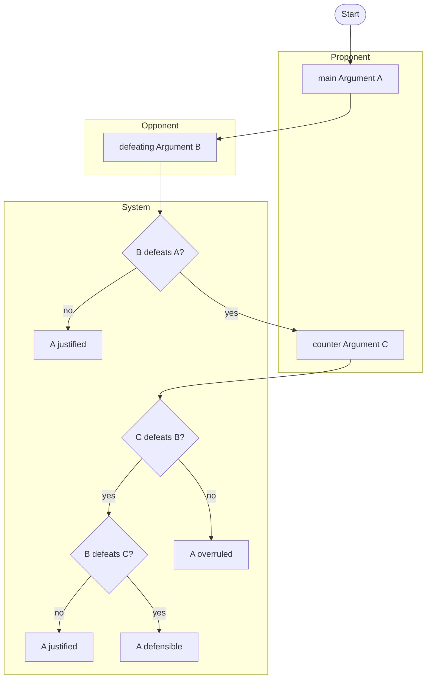
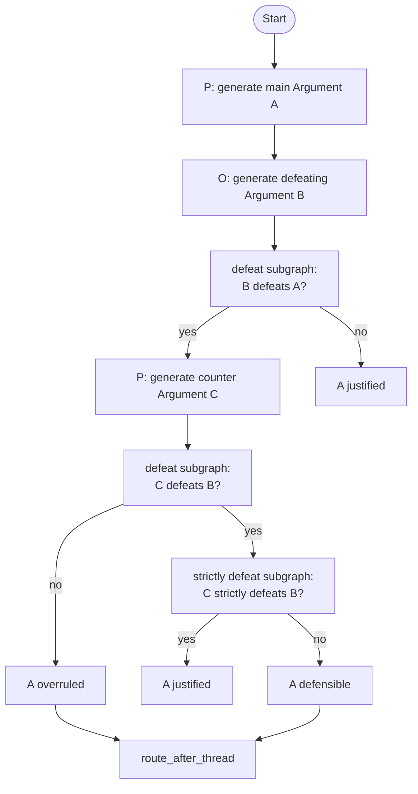
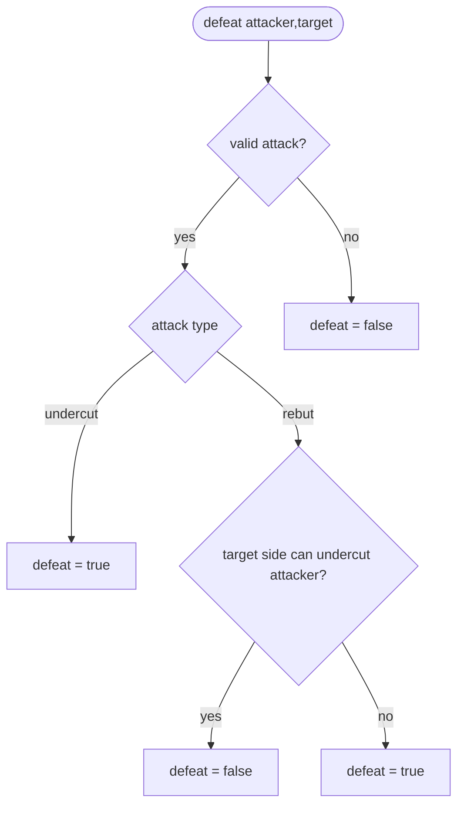
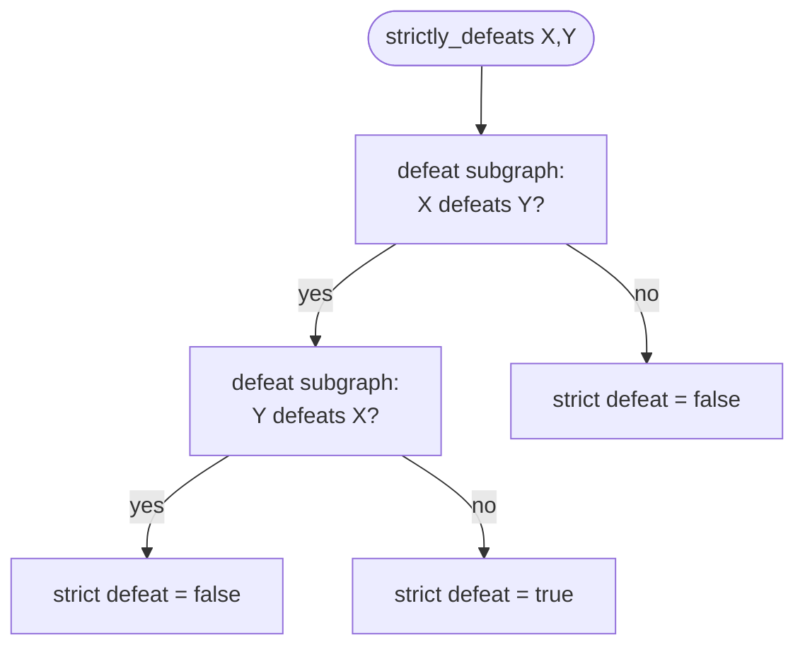

# A-B-C 一本鎖プロトコル修正 実装計画書

## 目的

現在の計画と実装は、`A <- B <- C <- D` の形で `C` に対する再攻撃 `D` を生成し、`D defeats C` の有無で `C strictly defeats B` を近似している。

しかし、今回採用する抽象フローでは argument tree を展開せず、`D` も生成しない。`strict defeat` は定義通り、`C defeats B` と逆向きの `B defeats C` を検証して判定する。

```text
C strictly defeats B
= C defeats B and not B defeats C
```

そのため、プロトコルを次の形へ修正する。

```text
A <- B <- C
```

- `A`: Proponent の main argument
- `B`: Opponent の defeating argument against A
- `C`: Proponent の counter argument against B

## 重要な設計変更

### D を生成しない

変更前:

```text
C defeats B
-> Opponent が C に対する D を生成する
-> D defeats C なら A defensible
-> D がなければ A justified
```

変更後:

```text
C defeats B
-> System が B defeats C を検証する
-> B defeats C が false なら C strictly defeats B なので A justified
-> B defeats C が true なら C strictly defeats B ではないので A defensible
```

この変更により、`strict defeat` の検証が新しい argument 生成ではなく、既存の `B` と `C` の相互 defeat 判定になる。

### 反論に対する再反論は main argument と同じ形に整形する

`B` は `A` を攻撃するため、生成時には `attack` と `target` が必要である。

一方で、`C` は `B` に対する counter argument として生成されるが、その後は `B defeats C` の検証対象になる。つまり `C` は攻撃側であると同時に、攻撃される側にもなる。

そのため、`C` の argument payload の中に次のような攻撃メタデータを残さない。

```json
{
  "attack": "rebut",
  "target": {
    "argument_id": "B",
    "field": "Conc",
    "statement": "..."
  }
}
```

代わりに、`C` の本体は main argument と同じスキーマに揃える。

```json
{
  "Argument": {
    "rules": [],
    "Conc": [],
    "Ass": []
  }
}
```

`C defeats B` という攻撃関係は、argument payload ではなく、別の relation として保持する。

```json
{
  "attacker_id": "C",
  "target_id": "B",
  "attack": "rebut",
  "valid": true,
  "reason": "C.Conc contradicts B.Conc"
}
```

この方針により、どの argument も「攻撃される側」になった時には main argument と同じ `rules / Conc / Ass` だけを持つ通常の argument として扱える。

## 抽象フロー



## Graph 分割方針

上位 graph は argument 生成と状態遷移だけを扱う。`defeat` と `strictly defeat` は別の再利用可能な helper subgraph として扱う。

実装上の配置:

- `src/agent/graphs/main.py`: 上位 graph と `State`。
- `src/agent/graphs/defeat.py`: `defeat` / `strictly defeat` の再利用可能な helper subgraph。
- `src/agent/graph.py`: 既存 import と `langgraph.json` 互換のための thin wrapper。

### 上位 graph



### defeat サブグラフ



### strictly defeat サブグラフ



## 責務分担

### Proponent

- `A` を生成する。
- `B defeats A` が成立した場合、`B` に対する counter argument `C` を生成する。
- `C` の payload は main argument と同じ `rules / Conc / Ass` 形式で出力する。

### Opponent

- `A` に対する defeating argument `B` を生成する。
- `B` の payload も最終的には `rules / Conc / Ass` 形式で保持する。
- `B defeats A` の攻撃メタデータは relation として保持する。

### System

- `B defeats A` を検証する。
- `C defeats B` を検証する。
- `B defeats C` を逆向きに検証する。
- `C strictly defeats B` を `C defeats B and not B defeats C` で判定する。
- `A` の状態を `justified` / `overruled` / `defensible` に分類する。
- 攻撃関係を `DefeatRelation` として保存する。

## 状態判定

### A justified

次のいずれかの場合、`A justified` とする。

- `B` が生成されない。
- `B defeats A` が成立しない。
- `C defeats B` が成立し、かつ `B defeats C` が成立しない。

### A overruled

次の場合、`A overruled` とする。

- `B defeats A` が成立する。
- しかし `C` が生成されない、または `C defeats B` が成立しない。

### A defensible

次の場合、`A defensible` とする。

- `B defeats A` が成立する。
- `C defeats B` も成立する。
- しかし `B defeats C` も成立するため、`C strictly defeats B` が成立しない。

## 旧実装の defeats 判定

修正前の実装には、`defeats(x, y)` という独立した判定関数はなかった。実際には、次の node と route の組み合わせで defeat を判定していた。

```text
generate_attack(...)
-> valid_declared_attack(attacker, target)
-> attack type に応じた route
-> rebut の場合だけ、target 側が attacker を undercut できるか確認
```

### 生成時の検証

`generate_attack(...)` は LLM に `DefeatingArgumentOutput` を生成させる。

```python
if output.can_defeat != "YES" or output.Argument is None:
    return None
```

その後、生成された argument に対して `valid_declared_attack(attacker, target)` を実行する。

```python
def valid_declared_attack(attacker, target):
    if attacker.attack == "undercut":
        return bool(conc(attacker)) and bool(ass(target))
    if attacker.attack == "rebut":
        return any(
            directly_contradicts(a, t)
            for a in conc(attacker)
            for t in conc(target)
        )
    return False
```

旧実装での意味は次の通り。

- `undercut`: attacker に `Conc` があり、target に `Ass` があれば valid とする。
- `rebut`: attacker の `Conc` と target の `Conc` のどれかが `directly_contradicts(...)` を満たせば valid とする。

注意点として、旧実装の `undercut` 検証はかなり粗い。`attacker.Conc` が `target.Ass` を本当に直接 invalidates しているかまでは、決定的には検証していない。`target.Ass` が空なら undercut は不可になる。

### rebut の defeat 判定

旧実装では、`rebut` が生成されただけでは最終的な defeat として確定しない。target 側が、その rebut argument を undercut できるかを追加で確認する。

`B` が `A` に対する `rebut` の場合:

```text
o_defeat_a
-> route_after_o_defeat_a
-> p_undercut_b
```

`p_undercut_b` で Proponent が `B` を undercut できる場合:

```text
B defeats A は成立しない
-> A justified
```

Proponent が `B` を undercut できない場合:

```text
B defeats A が成立する
-> p_counter_b に進む
```

コード上は次の relation が追加される。

```python
relation(state.b_argument, state.current_argument, True, "rebut not blocked by undercut")
```

つまり、旧実装の rebut defeat は次の近似である。

```python
defeats(B, A) =
    rebuts(B, A) and not can_undercut(A_side, B)
```

### undercut の defeat 判定

`B.attack == "undercut"` の場合は、追加の undercut check を挟まず、即座に defeat として扱う。

```text
o_defeat_a
-> B.attack == undercut
-> B defeats A
-> p_counter_b
```

コード上も `undercut` の場合は relation をすぐ記録している。

```python
relation(argument, state.current_argument, True, "undercut defeats target")
```

つまり、旧実装の undercut defeat は次の近似である。

```python
defeats(B, A) =
    undercuts(B, A)
```

ただし、前述の通り `undercuts(B, A)` の決定的検証は `bool(conc(B)) and bool(ass(A))` に近い。

### C defeats B の判定

`C` についても `B` と同じ rule が使われている。

`C.attack == "undercut"` の場合:

```text
C defeats B として扱う
```

`C.attack == "rebut"` の場合:

```text
Opponent が C を undercut できるか確認する
```

Opponent が `C` を undercut できる場合:

```text
C defeats B は成立しない
-> A overruled
```

Opponent が `C` を undercut できない場合:

```text
C defeats B が成立する
```

旧コードではこの後、`D` 生成に進む。

```text
C defeats B
-> o_defeat_c
-> D defeats C の有無で A justified / defensible を分ける
```

今回の修正では、この `D` 生成を削除し、代わりに既存の `B` と `C` で逆向きに `B defeats C` を検証する。

### 旧実装と修正後の対応

| 判定 | 旧実装 | 修正後 |
| --- | --- | --- |
| `B defeats A` | `B` を生成し、`rebut` なら `P can undercut B?` を確認 | 同じ考え方を `validate_b_defeats_a` に集約 |
| `C defeats B` | `C` を生成し、`rebut` なら `O can undercut C?` を確認 | 同じ考え方を `validate_c_defeats_b` に集約 |
| `C strictly defeats B` | `D defeats C` がないこととして近似 | `C defeats B and not B defeats C` で直接判定 |
| `B defeats C` | 旧実装には明示 node なし | `validate_b_defeats_c` を追加 |

## スキーマ修正方針

### 現状の問題

修正前は `AttackArgumentBody` が `ArgumentBody` を継承し、argument payload の中に `attack` と `target` を含めている。

```python
class AttackArgumentBody(ArgumentBody):
    attack: AttackType
    target: TargetReference
```

この形だと、`C` が後で `B defeats C` の target になったときにも、`C` の中に `attack: "rebut"` などが残る。これは「攻撃される側になった argument は main argument と同じ形で扱う」という今回の方針と合わない。

### 修正後

argument の本体は常に共通化する。

```python
class ArgumentBody(BaseModel):
    rules: list[Rule]
    Conc: list[str]
    Ass: list[str]
```

攻撃生成の出力は、argument 本体と攻撃メタデータを分離する。

```python
class AttackMetadata(BaseModel):
    attack: AttackType
    target: TargetReference

class DefeatingArgumentOutput(BaseModel):
    can_defeat: Literal["YES", "NO"]
    Argument: ArgumentBody | None
    Attack: AttackMetadata | None
```

内部状態の `ArgumentRecord` では、検索や表示のために `target_id` / `attack` を保持してよい。ただし、`argument` に保存する JSON payload には `attack` / `target` を混ぜない。

```python
class ArgumentRecord(BaseModel):
    type: Literal["main", "counter"]
    argument: str  # serialized ArgumentBody only
    target_id: str | None
    attack: AttackType | None
```

## Prompt 修正方針

### MAIN_ARGUMENT

現状通り、`rules / Conc / Ass` のみを出力させる。

### DEFEATING_ARGUMENT

`B` 生成用。攻撃方法と対象は必要だが、argument payload には入れない。

出力は次の構造にする。

```json
{
  "can_defeat": "YES",
  "Argument": {
    "rules": [],
    "Conc": [],
    "Ass": []
  },
  "Attack": {
    "attack": "rebut",
    "target": {
      "argument_id": "A",
      "field": "Conc",
      "statement": "..."
    }
  }
}
```

### COUNTER_ARGUMENT

`C` 生成用。`B` を defeat するための argument を作らせるが、出力本体は main argument と同じ形にする。

```json
{
  "can_defeat": "YES",
  "Argument": {
    "rules": [],
    "Conc": [],
    "Ass": []
  },
  "Attack": {
    "attack": "undercut",
    "target": {
      "argument_id": "B",
      "field": "Ass",
      "statement": "..."
    }
  }
}
```

## Graph / Node 修正方針

### 削除する node

- `o_defeat_c`
- `p_undercut_d`

### 追加または置換する node

- `validate_b_defeats_a`
- `generate_c_against_b`
- `validate_c_defeats_b`
- `validate_b_defeats_c`
- `classify_thread_status`

既存 node を活かす場合は、次の対応にする。

| 現在 | 修正後 |
| --- | --- |
| `o_defeat_a` | `B` を生成し、payload と attack metadata を分離して保存 |
| `p_undercut_b` | `validate_b_defeats_a` に統合、または system 判定へ移動 |
| `p_counter_b` | `C` を生成し、payload と attack metadata を分離して保存 |
| `o_undercut_c` | `validate_c_defeats_b` に統合、または system 判定へ移動 |
| `o_defeat_c` | 削除 |
| `p_undercut_d` | 削除 |

## ルーティング修正方針

変更前:

```text
p_main
-> o_defeat_a
-> p_undercut_b
-> p_counter_b
-> o_undercut_c
-> o_defeat_c
-> p_undercut_d
-> route_after_thread
```

変更後:

```text
p_main
-> o_defeat_a
-> validate_b_defeats_a
-> p_counter_b
-> validate_c_defeats_b
-> validate_b_defeats_c
-> route_after_thread
```

分岐は次の通り。

```text
validate_b_defeats_a:
  false -> A justified
  true  -> p_counter_b

validate_c_defeats_b:
  false -> A overruled
  true  -> validate_b_defeats_c

validate_b_defeats_c:
  false -> A justified
  true  -> A defensible
```

## 実装タスク

1. `docs/undercut_reinstatement_plan.md` の `A <- B <- C <- D` 記述を `A <- B <- C` に修正する。
2. `D` 生成による strict defeat 近似の説明を削除し、`C defeats B and not B defeats C` に置換する。
3. Mermaid 図から `D` 関連の node と分岐を削除する。
4. `src/agent/schema/outputs/schema.py` で attack metadata と argument payload を分離する。
5. `src/agent/prompt.py` の defeating / counter prompt を、`Argument` と `Attack` を分ける出力形式へ変更する。
6. `src/agent/nodes.py` から `o_defeat_c` / `p_undercut_d` を削除または未使用化する。
7. `B defeats C` を既存 argument 同士の逆向き validation として実装する。
8. `src/agent/edges.py` / `src/agent/graph.py` の D 関連 route を削除する。
9. `def.py` の表示では、argument payload と relation metadata を分けて表示する。
10. テストで次の 3 ケースを確認する。
    - `B defeats A` が false なら `A justified`
    - `B defeats A` が true かつ `C defeats B` が false なら `A overruled`
    - `B defeats A` と `C defeats B` が true のとき、`B defeats C` が false なら `A justified`、true なら `A defensible`

## 完了条件

- `D` argument が state / graph / prompt / display に登場しない。
- `C` の serialized payload に `attack` / `target` が含まれない。
- 攻撃関係は `DefeatRelation` または同等の relation として保存される。
- `C strictly defeats B` は `C defeats B and not B defeats C` で判定される。
- AG1 / AG2 の main argument がどちらも `justified` でない場合だけ、既存通り integration phase に進む。
