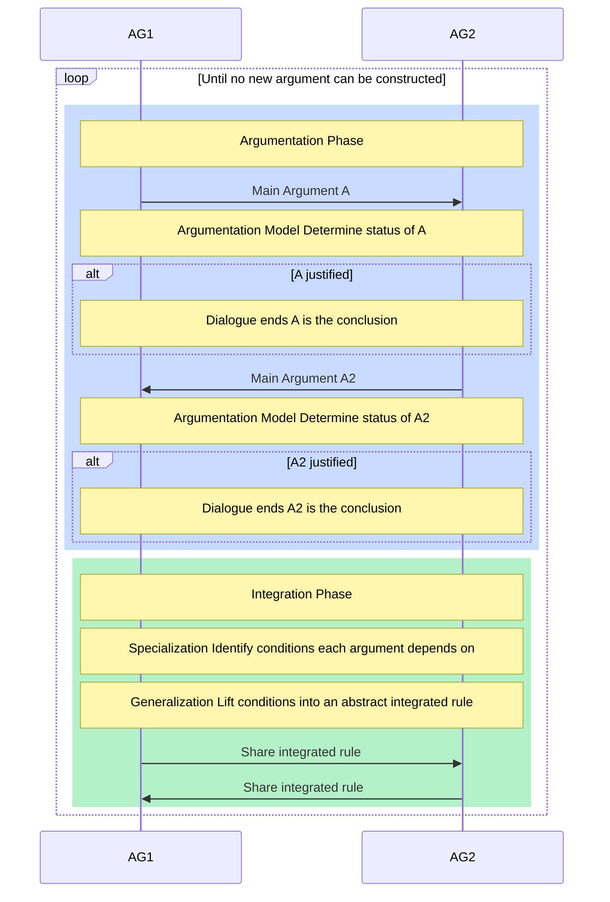
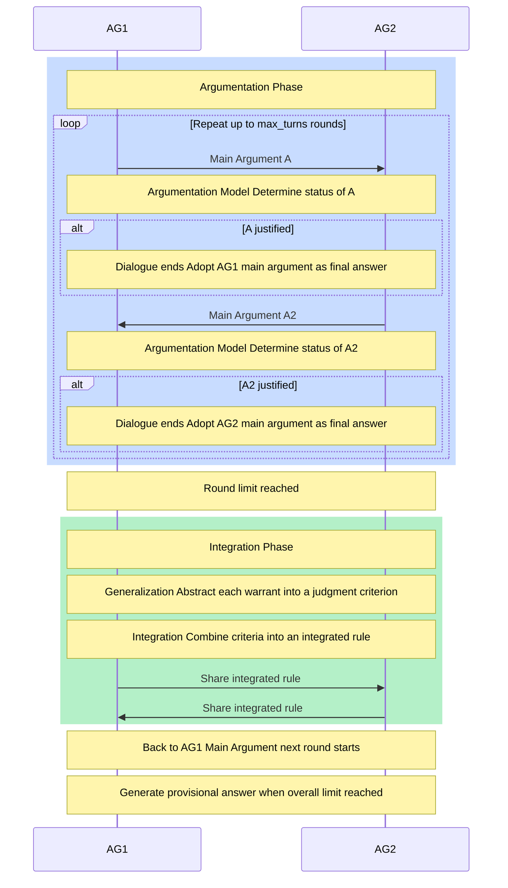
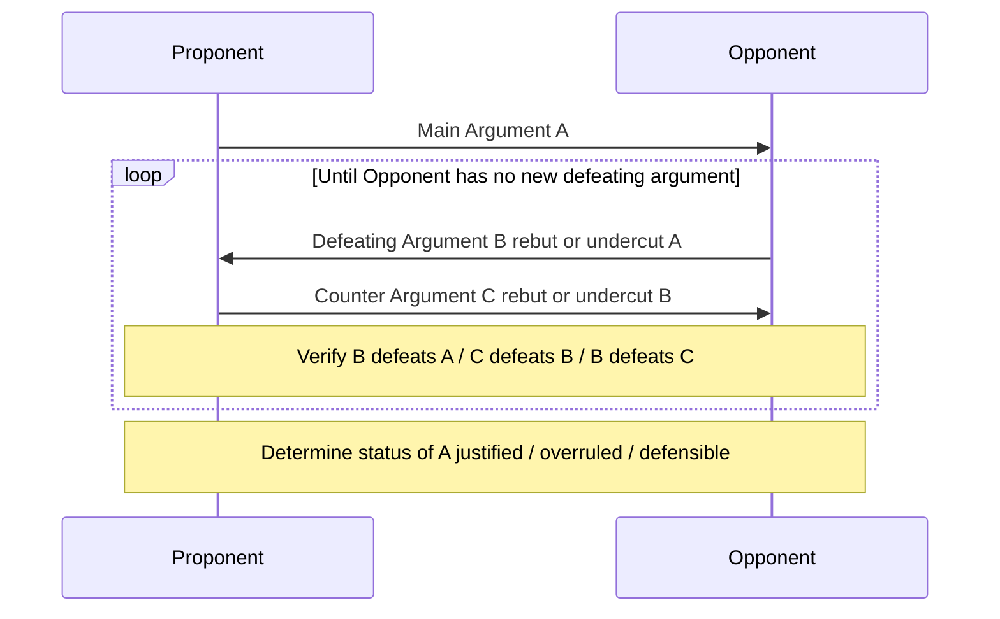
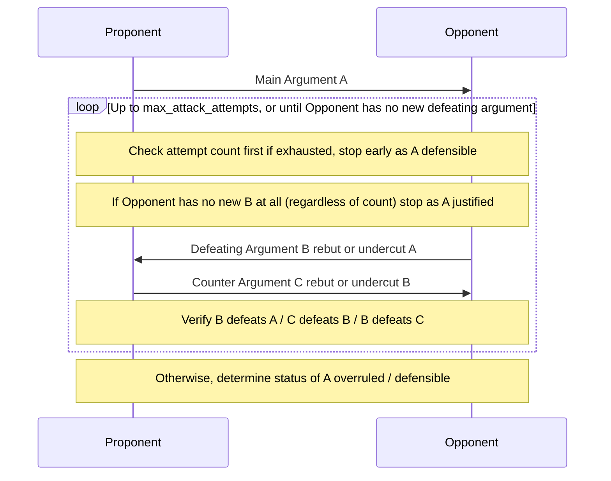
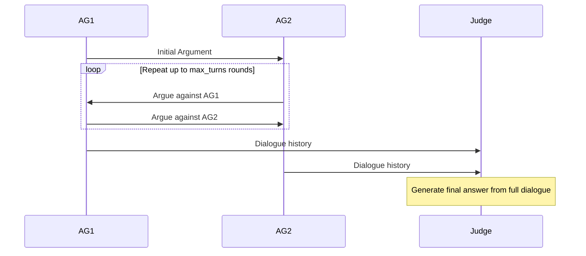
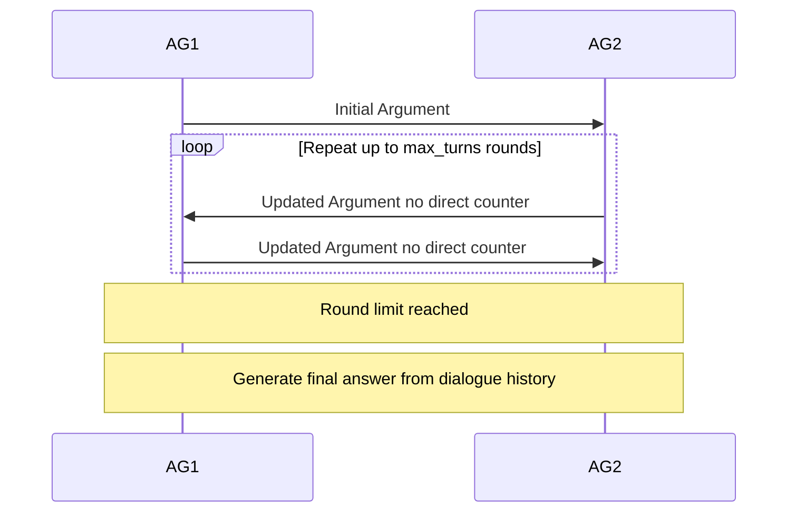

# Dialectical Argumentation Protocol Sequence Diagrams

## Figure 0: Computational Dialectics (Original — No Round Limit)

## Figure 1: Protocol Overview

## Figure 2: Argumentation Model

### Figure 2a: Prior Work (Prakken & Sartor) — 既存研究

### Figure 2b: Proposed Method (this implementation) — 提案手法

## Figure 3: MAD (Multi-Agent Debate)

## Figure 4: Free Debate

