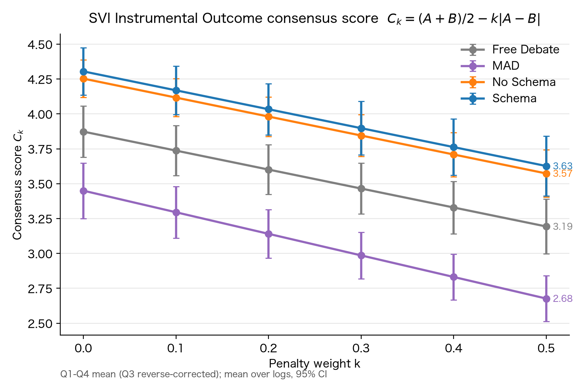
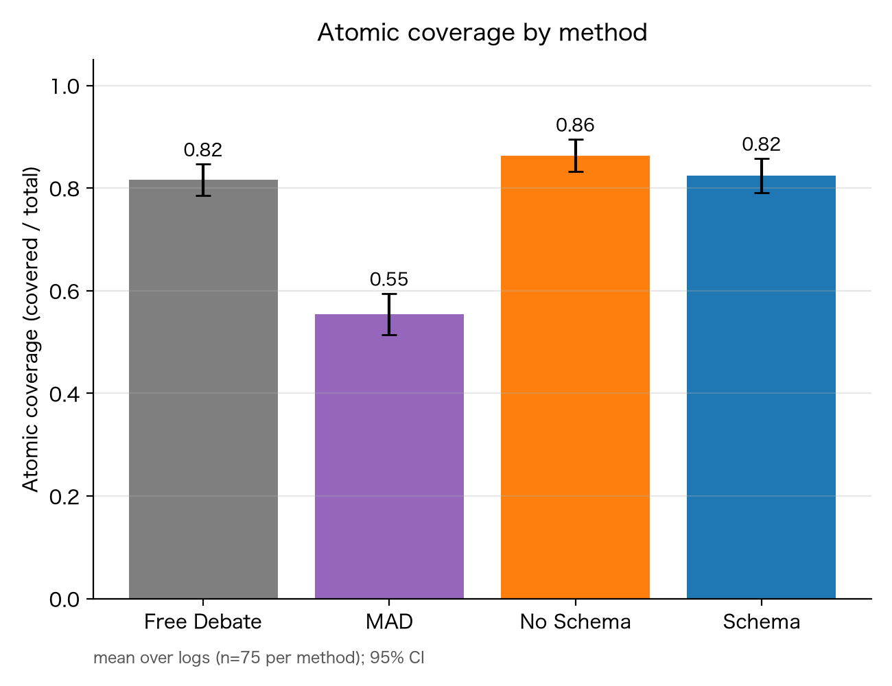
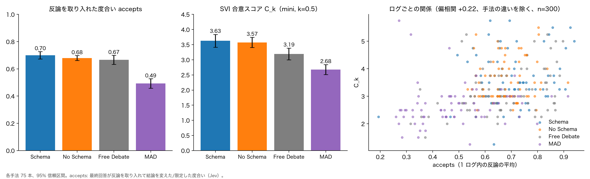

# 弁証法的マルチエージェント議論（Dialect-MAS）: 結果と限界（2026-10-06）

## 1. 目的と比較

2 人のエージェントが対立する立場から議論し、最終回答を作る。次の 4 手法を比較した。

| 手法 | 内容 |
|---|---|
| schema（提案） | Prakken & Sartor の論証（規則の連鎖、rebut / undercut、defeat）に沿った議論 |
| no_schema | 同じ議論の流れで、論証を自由な文章で書く |
| free_debate | 弁証法のプロトコルを使わない自由討議 |
| MAD | 多エージェント討論（既存手法） |

問い: schema の議論は、反論を取り込んだ統合案を作り、それが主体評価（当事者から見た満足度）で高く評価されるか。

## 2. 実験設定

- トピック 5 件 × 3 回 × 対話ターン上限 5 通り（10, 15, 20, 25, 30）= **各手法 75 ログ、計 300 ログ**（`logs/fin`）。
- 生成: gpt-5.4-nano（reasoning_effort=high）。
- 最終回答: schema と no_schema は、議論全体を中立に統合してから回答する経路（justified な主張があればその論証から回答）。
- 評価:
  - **SVI 合意スコア** C_k = (A+B)/2 − k·|A−B|（A, B は AG1, AG2 の満足度、Instrumental Outcome 4 項目）。評価器は gpt-5.4-mini。
  - **atomic coverage**: 立場文を原子的な主張に分け、最終回答がカバーした割合。
  - **反論への対処**: 議論から全手法で同じ方法で反論を抽出し（約 7,000 件）、最終回答が各反論をどう扱ったかを Jev で判定（accepts: 反論を取り入れて結論を変えた／限定した度合い）。

## 3. 結果

### 3.1 主体評価（SVI 合意スコア）: schema は free_debate と MAD より高い

- k=0.5 で、schema 3.63、no_schema 3.57、free_debate 3.19、MAD 2.68（各 75 ログ、95% 信頼区間 ± 0.16〜0.21）。順位は k=0〜0.5 のどこでも同じ。
- 対応のとれた差（25 セル、95% 信頼区間）: schema − free_debate = **+0.43 ± 0.26**、schema − MAD = **+0.95 ± 0.29**、schema − no_schema = +0.05 ± 0.25（差なし）。
- AG1 と AG2 の満足度の差 |A−B| は、schema 1.36、no_schema 1.36、free_debate 1.36、MAD 1.55。

### 3.2 最終回答の網羅性（atomic coverage）: schema の優位はない

- no_schema 0.86、schema 0.82、free_debate 0.82、MAD 0.55。MAD だけが明らかに低い。schema は no_schema を上回っていない。

### 3.3 反論への対処: 取り入れた最終回答ほど、主体評価が高い

- 反論を最終回答が取り入れた度合い（accepts）: schema 0.70、no_schema 0.68、free_debate 0.67、MAD 0.49。schema は no_schema・free_debate と同水準で、MAD より高い。
- ログ単位では、accepts が高いほど SVI が高い。手法の違いを除いた偏相関は **+0.22（p<0.001、n=300）**。反論を却下した度合い（rejects）は −0.16、反論がまだ効く度合い（still_valid）は −0.15。

## 4. 結論

- schema は、no_schema と同等の水準で、議論中の反論を最終回答に取り入れ、主体評価（SVI）で free_debate と MAD を上回った。
- 反論を取り入れた最終回答ほど主体評価が高く、反論への対処と主体評価がつながる。
- 一方、schema が no_schema を上回る証拠は、どの指標でも得られなかった。少ないターンで合意に達する、という当初の仮説も支持されなかった（全ログが対話ターン上限まで使われ、justified で終わったのは schema の 3 / 75 のみ。優先順位を実装していないため、rebut どうしが相互に defeat になり、終了しにくいと考えている）。

## 5. 限界

### 主張できないこと
- schema が no_schema より優れる、という根拠はない（SVI の差 +0.05 ± 0.25、atomic coverage は no_schema が高い）。
- 「多様かつ建設的な反論」は、定量的に示せていない。反論の数は、抽出のたびに約 4 割が入れ替わり、記録の見た目にも左右されるため、多様さの指標に使えない。
- accepts と SVI の関係は相関であり、因果ではない（妥協的な最終回答が、取り入れと高評価の両方を生んだ可能性）。

### 実験設計
- **規模:** 5 トピック、各手法 75 ログ。SVI で検出できる最小の差は約 0.33〜0.38 で、それより小さい差（schema と no_schema の差など）は判断できない。
- **生成時のコードの版が、手法間で違う:** schema と no_schema は 2026-10-04 の実装（weak_negation の定義修正、反論側の取り違え防止を含む）、MAD と free_debate は 2026-10-02 の実装のログ。
- **free_debate だけ、最終回答の作り方が違う:** free_debate は旧方式（両者の最後の発言から統合ルール 1 個を作り、そこから回答）で、他の手法は議論全体の統合。free_debate の低さの一部は、この違いによる可能性がある。
- 生成モデルは nano のみ、SVI の評価器は mini のみ。nano と mini の評価は一致しなかった（nano の結果は、この報告から除いた）。
- 評価ファイルにモデル名が残らず、atomic coverage と反論の評価の実行時の設定は、確認できていない。

### 反論の評価
- 反論の抽出は 1 回の LLM 呼び出しで、再現性が低い（別の回と内容が対応する割合は 56〜72%）。
- Jev の質問のうち still_valid は、約 6 割の判定が確信のない値（0.35〜0.65）で、比較に使えなかった。
- 確信度の閾値は、人手による確認で決めていない。

## 6. 今後

- 優先順位（Prakken & Sartor Sec. 5–6）の実装による、合意（justified）への到達の検証。
- MAD と free_debate を、最新のコードで再実行し、版と最終回答の作り方をそろえた比較にする。
- 反論の抽出を複数回行って多数決にし、再現性を上げる。多様さと建設性は、人手によるログの確認で補う。
- 評価器とトピックを増やし、検出できる差を小さくする。

## データの場所

- ログと評価結果: `logs/fin`（手法ごとの出どころは `logs/fin/MANIFEST.md`）。
- 反論の判定（新しい抽出・質問）: `logs/fin_test2`。
- 図の作成: `logs/fin/analysis/make_figure.py`、`experiments/eval/plots/plot_svi_consensus_score.py`、`experiments/eval/plots/plot_atomic_coverage.py`。
