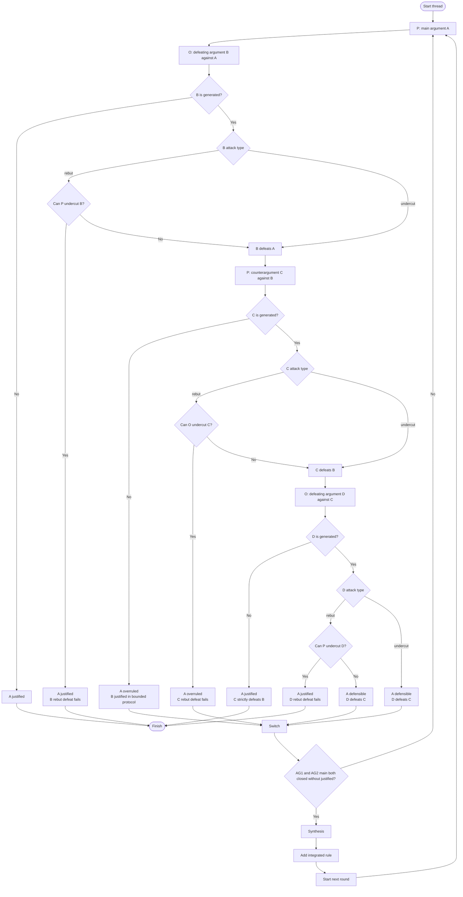
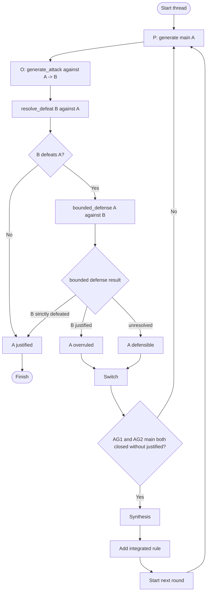

# undercut 復元と 1本道 strict defeat 対応 実装計画書

## 目的

攻撃手法として `undercut` を戻し、`weak_negation` / `Ass` を Argument スキーマへ復元する。

ただし、今回の実装では argument tree を完全展開しない。1つの main argument に対して発生する議論は 1本道に制限し、最大で次の 4 argument までを扱う。

```text
A <- B <- C <- D
```

- `A`: P の main argument
- `B`: O の defeating argument against A
- `C`: P の counterargument against B
- `D`: O の defeating argument against C

この制限により、文献 5章の `rebut` / `undercut` / `defeat` / `strict defeat` / `justified` / `overruled` / `defensible` を最小限扱いつつ、`justified` 判定の再帰的な多重ネストを避ける。

## 文献上の位置づけ

`kido_kurihara.pdf` では、5章で Prakken and Sartor [9] に基づく Argumentation Model が導入され、6章で negotiation application が示されている。

5章では次が定義されている。

- defeasible rule: `L1 ∧ ... ∧ Lj ∧ ~Lj+1 ∧ ... ∧ ~Ln-1 => Ln`
- `~L`: 「there is no evidence that L」を意味する弱否定
- `Ass(A)`: argument `A` に含まれる assumption
- `Conc(A)`: argument `A` に含まれる conclusion
- `rebut`
- `undercut`
- `defeat`
- `strict defeat`
- `justified`
- `overruled`
- `defensible`

一方、6章の具体例では各 agent の theory `Si` が only strict rules と明記されている。そのため、6章の例では `Ass(A)` が空になり、`undercut` は実質的に発生しない。

したがって、本計画は「6章の例をそのまま実装する」ものではない。6章の phase 構造を維持しながら、5章の full Argumentation Model のうち、`weak_negation` / `Ass` / `undercut` / `strict defeat` を導入する拡張である。

## 実装上の制限

文献の `justified` 定義は再帰的な探索を要求しうる。

```text
A is justified if no argument defeats A
or if every argument which defeats A is also strictly defeated.
```

例えば `B justified?` を厳密に調べるには、`B` を defeat する `C`、さらに `C` を strictly defeat する `D`、さらにその先、という探索が発生しうる。

今回の実装では、この再帰を完全には追わない。次の制限を置く。

- `A` に対する `B` は 1つだけ生成する。
- `B` に対する `C` は 1つだけ生成する。
- `C` に対する `D` は 1つだけ生成する。
- `D` より先の argument は生成しない。
- `A` の状態は、この 1本道の範囲で `justified` / `overruled` / `defensible` に分類する。
- `overruled` はその candidate の不採用を意味するが、protocol 全体の終了条件ではない。
- `synthesis` に進むのは、同一 round 内で AG1 / AG2 の main argument がどちらも `justified` 以外で閉じた場合とする。
- `synthesis` は終端ではない。統合によって新しい rule を生成し、その rule を使って次 round の main argument 生成に戻る。

これは完全な argumentation semantics ではなく、6章の簡略 protocol に `undercut` と `strict defeat` を追加するための bounded dialogue protocol である。

## 仕様まとめ

### Argumentation Model

今回扱う argument は、5章の Argumentation Model を実装しやすい JSON へ写したものとする。

```json
{
  "Argument": {
    "attack": "rebut or undercut",
    "target": {
      "argument_id": "target id",
      "field": "Conc or Ass",
      "statement": "attacked statement"
    },
    "rules": [
      {
        "id": "r1",
        "antecedent": {
          "strong": [],
          "weak_negation": []
        },
        "consequent": ""
      }
    ],
    "Conc": [],
    "Ass": []
  }
}
```

main argument では `attack` と `target` は `null` または省略可能とする。defeating argument / counterargument では必須とする。

各フィールドの意味:

- `rules`: argument を構成する rule の列。
- `antecedent.strong`: strict premise。前段 rule の consequent を含めてもよい。
- `antecedent.weak_negation`: `~L` に相当する弱否定。「L の証拠がない」という仮定。
- `Conc`: 各 rule の consequent を集めたもの。
- `Ass`: 各 rule の `weak_negation` から作る assumption 集合。
- `attack`: `rebut` または `undercut`。
- `target`: どの argument の `Conc` / `Ass` を攻撃しているか。

strict rule の場合、`weak_negation` と `Ass` は空配列でよい。

攻撃関係:

- `rebut`: attacker の `Conc` が target の `Conc` と矛盾する。
- `undercut`: attacker の `Conc` が target の `Ass` を崩す。
- `defeat`: `undercut` は常に defeat。`rebut` は target 側から undercut されない場合だけ defeat。
- `strict defeat`: `X defeats Y` かつ `Y does not defeat X`。

### 議論のルール

議論は round 単位で進む。各 round では AG1 と AG2 の main argument を別々に扱う。

1. P が main argument `A` を出す。
2. O が `A` に対する defeating argument `B` を出す。
3. `B` が出ない、または `B defeats A` が成立しない場合、`A justified` として終了する。
4. `B defeats A` が成立した場合、P が `B` に対する counterargument `C` を出す。
5. `C` が出ない、または `C defeats B` が成立しない場合、`A overruled` として current thread を閉じる。
6. `C defeats B` が成立した場合、O が `C` に対する defeating argument `D` を出す。
7. `D` が出ない、または `D defeats C` が成立しない場合、`C strictly defeats B` とみなし、`A justified` として終了する。
8. `D defeats C` が成立した場合、`C strictly defeats B` は不成立とし、`A defensible` とする。
9. `A defensible` かつ同一 round でもう片方の main argument が未評価なら、P/O を交代して相手側 main argument を評価する。
10. AG1 と AG2 の main argument がどちらも `justified` 以外、つまり `overruled` または `defensible` で閉じた場合、統合フェーズへ進む。
11. 統合フェーズで新しい rule を生成し、`integrated_rules` に追加する。
12. 次 round に入り、新しい rule を使って AG1 main argument 生成から再開する。

この protocol では、1つの main argument から分岐する複数 defeater は扱わない。各 target に対して生成する argument は 1つだけである。

### 終了条件

本来の成功終了条件は次の 1 つである。

- いずれかの main argument が `justified` になった。

`overruled` と `defensible` は current thread の終了条件だが、protocol 全体の終了条件ではない。同一 round 内で AG1 / AG2 の main argument がどちらも `justified` 以外で閉じた場合は、統合によって新しい rule を作り、その rule を使って次 round の main argument を生成する。

`synthesis` / `integrate` は終了条件ではない。これらは次 round のための rule 生成工程である。

`max_rounds` は理論上の終了条件ではなく、実装上の安全弁である。

## 復元対象

過去コミットでは、`d65cb02 [feat]rebutのみ、統合は合意核まで` で `undercut` と `weak_negation` の扱いが削られている。復元元としては、その親である `c5d0b0d [feat]LangGraphを使った実装` を参照する。

復元・変更する対象は次の通り。

- `src/agent/prompt.py`
  - `MAIN_ARGUMENT` に `antecedent.weak_negation` と `Ass` を戻す。
  - `DEFEATING_ARGUMENT` に `attack: rebut or undercut` を戻す。
  - `target` 情報を追加し、どの argument / field / statement を攻撃したかを出力させる。
  - `C` / `D` 生成用に、target argument を明示する prompt を追加または共通化する。
- `src/agent/schema/outputs/schema.py`
  - `ArgumentRecord` に `id`, `target_id`, `attack`, `status` を追加する。
  - `DefeatRelation` または同等の relation 記録 model を追加する。
- `src/agent/graph.py`
  - `A <- B <- C <- D` の 1本道 protocol に合わせて node / route を整理する。
  - `last_can_defeat` だけで分岐せず、`attack`, `target_id`, `status` を使う。
  - `extract_warrants` で `weak_negation` を再び抽出対象にする。
- `def.py`
  - `argument_statuses`, `defeat_relations`, `attack`, `target` を表示対象に含める。

## 用語と判定

### rebut

`X` が `Y` を rebut するとは、`X.Conc` が `Y.Conc` と矛盾すること。

実装では LLM に `attack: "rebut"` と出力させるだけでなく、`target.statement` を持たせ、後段で検証する。

### undercut

`X` が `Y` を undercut するとは、`X.Conc` が `Y.Ass` を崩すこと。

`Y.Ass` が空の場合、`undercut` は不可とする。

### defeat

文献の定義に合わせる。

```python
def defeats(x, y):
    if undercuts(x, y):
        return True
    if rebuts(x, y) and not undercuts(y, x):
        return True
    return False
```

今回の 1本道 protocol では、以下のように運用する。

- `B` が `A` を `undercut` するなら、`B defeats A` は成立する。
- `B` が `A` を `rebut` する場合、P/A が `B` を `undercut` できるなら `B defeats A` は成立しない。
- `C` と `D` についても同じ rule で判定する。

### strict defeat

```python
def strictly_defeats(x, y):
    return defeats(x, y) and not defeats(y, x)
```

ただし今回の protocol では、`C strictly defeats B` の確認を、`D defeats C` が成立するかどうかで近似する。

- `D` が出ない、または `D defeats C` が成立しない場合、`C strictly defeats B` とみなす。
- `D defeats C` が成立する場合、`C strictly defeats B` は不成立とする。

この近似は、`B does not defeat C` を直接厳密判定する代わりに、O が `C` に対する有効な defeating argument `D` を出せるかで判定する設計である。

## 状態分類

### A justified

次のいずれかの場合、`A justified` とする。

- O が `A` に対する有効な `B` を出せない。
- `B` が `rebut` だが、P が `B` を `undercut` できるため、`B defeats A` が成立しない。
- `B defeats A` は成立したが、`C strictly defeats B` が成立する。

### A overruled

次の場合、`A overruled` とする。

- `B defeats A` が成立する。
- P が `B` を defeat する `C` を出せない。
- または `C` が出ても `C defeats B` が成立しない。

この場合、bounded protocol 上では `B justified` とみなし、`A` は justified argument に defeat されたものとして扱う。

`overruled` は current candidate の不採用状態である。今回の system protocol では、片方の main argument が `overruled` になっても議論全体は終了しない。もう片方の main argument を試し、両方が `justified` 以外なら synthesis に進む。

### A defensible

次の場合、`A defensible` とする。

- `B defeats A` が成立する。
- `C defeats B` も成立する。
- しかし `D defeats C` も成立するため、`C strictly defeats B` が成立しない。

つまり、`A` は攻撃されたが、`B` も完全には通らず、`C` も `B` を完全に退けられていない未決着状態である。

`defensible` は未決着状態である。片方の main argument が `defensible` の場合だけ P/O を交代して相手側の main argument を試す。両方の main argument が `defensible` になった場合に限り、synthesis に進む。

## アクティビティ図



## 抽象化した組み立て方

上のアクティビティ図は実装時に分かりやすい具体フローである。一方、実装では同じ判定が複数回出てくるため、次の部品に分けて使い回す。

### 再利用する部品

#### `generate_attack(attacker, target, purpose)`

agent が `target` に対する argument を生成する。

用途:

- `O` が `A` に対して `B` を生成する。
- `P` が `B` に対して `C` を生成する。
- `O` が `C` に対して `D` を生成する。

返す値:

```python
AttackResult(
    argument=ArgumentRecord | None,
    can_attack=bool,
    attack="rebut" | "undercut" | None,
    target_id=str,
)
```

#### `can_undercut(agent, target)`

`target` が `rebut` argument として使われる場合に、相手がその `target.Ass` を崩せるかを見る。

用途:

- `B.attack == "rebut"` のとき、P が `B` を undercut できるか。
- `C.attack == "rebut"` のとき、O が `C` を undercut できるか。
- `D.attack == "rebut"` のとき、P が `D` を undercut できるか。

返す値:

```python
UndercutCheck(
    can_undercut=bool,
    argument=ArgumentRecord | None,
)
```

#### `resolve_defeat(attacker, target, defender)`

`attacker` が `target` を defeat するかを判定する共通部品。

処理:

```text
attacker が存在しない:
  -> no_defeat

attacker.attack == undercut:
  -> defeat

attacker.attack == rebut:
  defender が attacker を undercut できる:
    -> no_defeat
  defender が attacker を undercut できない:
    -> defeat
```

これにより、`B defeats A`, `C defeats B`, `D defeats C` を同じ関数で扱える。

返す値:

```python
DefeatCheck(
    defeats=bool,
    blocked_by_undercut=bool,
    blocker=ArgumentRecord | None,
)
```

#### `bounded_defense(main, defeater, proponent, opponent)`

`A` と `B` が与えられた後、`C` と `D` まで見て `A` の status を返す。

処理:

```text
P が B に対する C を生成する
  C が B を defeat しない:
    -> A overruled

  C が B を defeat する:
    O が C に対する D を生成する
      D が C を defeatしない:
        -> A justified

      D が C を defeatする:
        -> A defensible
```

返す値:

```python
ThreadResult(
    main_status="justified" | "overruled" | "defensible",
    arguments=list[ArgumentRecord],
    relations=list[DefeatRelation],
)
```

`main_status == "overruled"` は protocol の停止を意味する。`main_status == "defensible"` の場合だけ、同一 round 内で相手側 main argument へ交代する。

### 抽象化版アクティビティ図



### 部品と具体フローの対応

| 具体フロー | 抽象部品 |
| --- | --- |
| `O: defeating argument B against A` | `generate_attack(O, A, "defeat_main")` |
| `B attack type` | `resolve_defeat(B, A, P)` |
| `Can P undercut B?` | `can_undercut(P, B)` inside `resolve_defeat` |
| `P: counterargument C against B` | `generate_attack(P, B, "defend_main")` inside `bounded_defense` |
| `Can O undercut C?` | `can_undercut(O, C)` inside `resolve_defeat(C, B, O)` |
| `O: defeating argument D against C` | `generate_attack(O, C, "test_strict_defeat")` inside `bounded_defense` |
| `Can P undercut D?` | `can_undercut(P, D)` inside `resolve_defeat(D, C, P)` |

### 実装方針

LangGraph の node は具体フローに合わせて分けてもよいが、内部実装は上の部品を使い回す。

推奨:

- node 名は具体的にしてデバッグしやすくする。
- helper は抽象化して重複を避ける。
- routing は `ThreadResult.main_status` だけを見る。

例:

```python
async def o_defeat_a(state: State) -> dict[str, Any]:
    result = await generate_attack(
        state=state,
        attacker=state.current_opponent,
        target_id=state.current_main_id,
        purpose="defeat_main",
    )
    defeat = await resolve_defeat(
        state=state,
        attacker=result.argument,
        target=state.current_argument,
        defender=state.current_proponent,
    )
    ...
```

## LangGraph node 設計

ノードは agent の行動単位を基本にする。

### `p_main`

現在の P が main argument `A` を生成する。

出力:

- `current_main_id`
- `current_argument`
- `history`
- `dialogue_history`

### `o_defeat_a`

現在の O が `A` に対する defeating argument `B` を生成する。

出力:

- `b_argument`
- `b_attack`
- `b_target_id`
- `b_can_defeat`

### `p_undercut_b`

`B.attack == "rebut"` の場合だけ実行する。

P が `B` を undercut できるかを判定し、可能なら undercut argument を生成する。

出力:

- `p_can_undercut_b`
- optional `c_or_undercut_argument`

ここで undercut できた場合、`B defeats A` は成立しないため、`A justified` で終了する。

### `p_counter_b`

`B defeats A` が成立した後、P が `B` に対する counterargument `C` を生成する。

出力:

- `c_argument`
- `c_attack`
- `c_target_id`
- `c_can_defeat`

`C` が出ない、または `C defeats B` が成立しない場合、bounded protocol では `B justified` とみなし、`A overruled` とする。

### `o_defeat_c`

`C defeats B` が成立した後、O が `C` に対する defeating argument `D` を生成する。

出力:

- `d_argument`
- `d_attack`
- `d_target_id`
- `d_can_defeat`

`D defeats C` が成立しない場合、`C strictly defeats B` とみなし、`A justified` とする。

`D defeats C` が成立する場合、`C strictly defeats B` は不成立とし、`A defensible` とする。

### `route_after_thread`

`A justified` / `A overruled` / `A defensible` で thread が閉じたときに実行する。

- `A justified` の場合、成功として終了する。
- `A overruled` の場合、current thread を閉じる。まだもう片方の main argument を試していない場合は P/O を交代する。
- `A defensible` かつ同一 round 内でもう片方の main argument をまだ試していない場合、P/O を交代して `p_main` へ戻る。
- 同一 round 内で AG1 / AG2 の main argument がどちらも `justified` 以外で閉じた場合、`synthesis` へ進む。

### `synthesis`

同一 round 内で AG1 / AG2 の main argument がどちらも `justified` 以外で閉じた場合に実行する。

既存の `extract_warrants -> generalize -> integrate` を使う。ただし、warrant には `weak_negation` も含める。

`synthesis` の出力は final answer ではなく、新しい rule である。

### `add_integrated_rule`

`synthesis` で生成した新しい rule を次 round の main argument 生成に使えるように追加する。

追加先は次のいずれかに統一する。

- 共有 rule として `integrated_rules` に保持し、AG1 / AG2 の main argument 生成 prompt の両方に渡す。
- または既存実装に合わせて AG1 / AG2 の stance へ同じ rule を追記する。

推奨は `integrated_rules` として別管理する方式。元の stance と統合で生まれた rule を区別でき、round ごとの効果を追跡しやすい。

`add_integrated_rule` 後は、`debate_round += 1` として `p_main` に戻る。

次 round 開始時には、round-local な main argument と thread status をリセットする。

```text
ag1_main_argument = None
ag2_main_argument = None
ag1_thread_status = None
ag2_thread_status = None
current_proponent = AG1
current_opponent = AG2
```

過去 round の main argument と status は `round_main_arguments` / `round_thread_statuses` に保存してからリセットする。

## 追加する状態

`State` に次を追加する。

```python
current_proponent: AgentName
current_opponent: AgentName
debate_round: int
integrated_rules: list[str]
round_main_arguments: dict[str, dict[AgentName, str]]
round_thread_statuses: dict[str, dict[AgentName, str]]
defeat_relations: list[DefeatRelation]
current_main_id: str | None
ag1_current_main_id: str | None
ag2_current_main_id: str | None
b_argument_id: str | None
c_argument_id: str | None
d_argument_id: str | None
```

AG1 と AG2 の main argument は必ず分けて保持する。

```python
ag1_main_argument: ArgumentRecord | None
ag2_main_argument: ArgumentRecord | None
ag1_thread_status: Literal["justified", "overruled", "defensible", "undetermined"] | None
ag2_thread_status: Literal["justified", "overruled", "defensible", "undetermined"] | None
```

round をまたいだ履歴が必要な場合は、`round_main_arguments` と `round_thread_statuses` に snapshot を残す。

`ArgumentRecord` は次の optional field を持つ。

```python
id: str
target_id: str | None
attack: Literal["rebut", "undercut"] | None
status: Literal["justified", "overruled", "defensible", "undetermined"] | None
```

`DefeatRelation` は次の形にする。

```python
class DefeatRelation(BaseModel):
    attacker_id: str
    target_id: str
    attack: Literal["rebut", "undercut"]
    valid: bool
    reason: str | None = None
```

## プロンプト改修

### `MAIN_ARGUMENT`

`weak_negation` と `Ass` を復元する。

必須フィールド:

- `rules[*].antecedent.strong`
- `rules[*].antecedent.weak_negation`
- `rules[*].consequent`
- `Conc`
- `Ass`

strict rule の場合、`weak_negation` と `Ass` は空配列でよい。

### `DEFEATING_ARGUMENT`

`rebut` と `undercut` の両方を許可する。

出力には `target` を必ず含める。

```json
{
  "can_defeat": "YES or NO",
  "Argument": {
    "attack": "rebut or undercut",
    "target": {
      "argument_id": "target argument id",
      "field": "Conc or Ass",
      "statement": "target statement"
    },
    "rules": [],
    "Conc": [],
    "Ass": []
  }
}
```

### `UNDERCUT_CHECK`

`B.attack == "rebut"` または `D.attack == "rebut"` のときに使う。

目的:

- target argument の `Ass` を崩せるか判定する。
- 可能なら undercut argument を生成する。

出力:

```json
{
  "can_undercut": "YES or NO",
  "Argument": {
    "attack": "undercut",
    "target": {
      "argument_id": "target argument id",
      "field": "Ass",
      "statement": "target assumption"
    },
    "rules": [],
    "Conc": [],
    "Ass": []
  }
}
```

### `VALIDATE_ATTACK`

LLM の `attack` ラベルをそのまま信じないため、軽量 validator を追加する。

入力:

- attacker argument
- target argument
- declared attack
- declared target

出力:

```json
{
  "valid": true,
  "attack": "rebut or undercut",
  "reason": "short reason"
}
```

## 統合フェーズへの影響

`extract_warrants` では、main argument の最後の rule から次を抽出する。

```json
{
  "warrant": {
    "antecedent": {
      "strong": [],
      "weak_negation": []
    },
    "consequent": ""
  }
}
```

`weak_negation` を統合フェーズで無視しない。特に、main argument が undercut で崩れた場合、どの assumption が崩れたかを synthesis の材料として保持する。

統合フェーズは終端ではない。処理は次の流れにする。

```text
extract_warrants
-> generalize
-> integrate
-> add_integrated_rule
-> debate_round += 1
-> p_main
```

統合によってできるのは final answer ではなく、次 round の main argument 生成に使う新しい rule である。

## 終了条件

今回の protocol の本来の成功終了条件は次の 1 つである。

- いずれかの main argument が `justified` になった場合、成功として終了する。

`overruled` と `defensible` は protocol 全体の終了条件ではない。両 main argument が `justified` 以外の場合に統合を行い、生成された rule を使って次 round の main argument を生成する。

`synthesis` / `integrate` も終了条件ではない。これらは次 round の main argument を生成するための rule を作る中間工程である。

`max_rounds` は理論上の終了条件ではなく、実装上の安全弁として置く。`max_rounds` に到達しても `justified` が出ない場合は、未解決として停止する。

## 実装順序

1. `schema.py` に `id`, `target_id`, `attack`, `status`, `DefeatRelation` を追加する。
2. `prompt.py` に `weak_negation` / `Ass` / `undercut` / `target` を復元・追加する。
3. `_extract_json_from_argument` 周辺に `attack`, `target`, `Conc`, `Ass`, rule-level `weak_negation` の抽出 helper を追加する。
4. `validate_attack` helper を追加する。
5. `p_main`, `o_defeat_a`, `p_undercut_b`, `p_counter_b`, `o_defeat_c`, `route_after_thread` を `graph.py` に実装する。
6. 現行の `ag1_main`, `ag2_attack_ag1`, `ag1_attack_ag2` などを新 protocol に合わせて置き換える、または wrapper 化する。
7. `extract_warrants` に `weak_negation` を戻す。
8. `synthesis` / `integrate` の結果を `integrated_rules` に追加し、次 round の `p_main` へ戻す。
9. AG1 / AG2 の main argument と thread status を別々に保持する。
10. `def.py` の表示処理に `attack`, `target`, `status`, `defeat_relations`, `integrated_rules`, `debate_round` を追加する。
11. unit test を追加する。
12. integration test で AG1/AG2 の main が両方 `defensible` で閉じた後に synthesis へ進み、その後 next round の main argument が生成されることを確認する。

## テスト計画

LLM を使わない unit test:

- `Ass` が抽出できる。
- rule-level `weak_negation` が flatten される。
- `undercut` は target `Ass` が空なら不可。
- `rebut` は target `Conc` への矛盾として扱われる。
- `B.rebut` に対して P が `B` を undercut できる場合、`B defeats A` は成立しない。
- `B.undercut` の場合、`B defeats A` が成立する。
- `C defeats B` かつ `D defeats C` がない場合、`A justified` になる。
- `C defeats B` かつ `D defeats C` がある場合、`A defensible` になる。
- `B defeats A` かつ `C` がない場合、`A overruled` になる。

integration test:

- AG1 main が rebut されるが、AG1 が undercut して justified になる。
- AG1 main が undercut され、AG1 が counter できず overruled になる。
- AG1 main が undercut され、AG1 が counter するが AG2 が `D` を出して defensible になる。
- AG1 thread と AG2 thread がどちらも `justified` 以外で閉じたら synthesis へ進む。
- synthesis が生成した rule が `integrated_rules` に追加される。
- synthesis 後に protocol が終了せず、次 round の AG1 main argument 生成に戻る。
- 片方の thread が `overruled` になっても、もう片方の main argument を試す。

## 注意点

この計画は、文献 5章の argumentation semantics を完全実装するものではない。

特に、`justified` の完全な再帰評価や、複数 defeater を持つ argument tree は扱わない。今回扱うのは、6章の negotiation protocol に合わせた bounded one-chain protocol である。

その代わり、次の性質を明示的に実装する。

- strict rule では `Ass` は空でよい。
- defeasible rule では `weak_negation` / `Ass` を持てる。
- `undercut` は `Ass` に対する攻撃として扱う。
- `rebut` は相手から `undercut` されると defeat にならない。
- `strict defeat` は `C` と `D` の bounded check で扱う。
- `overruled` / `defensible` は、この bounded check の範囲での状態である。
